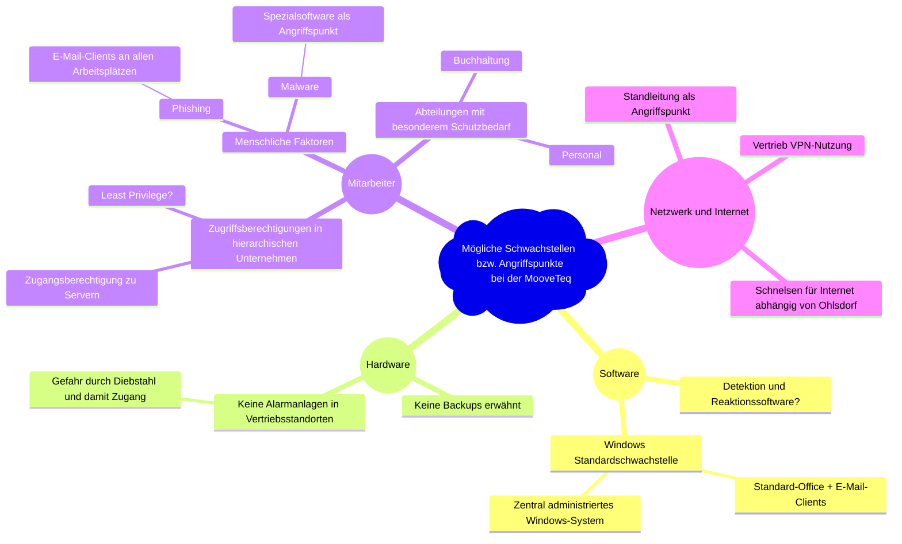
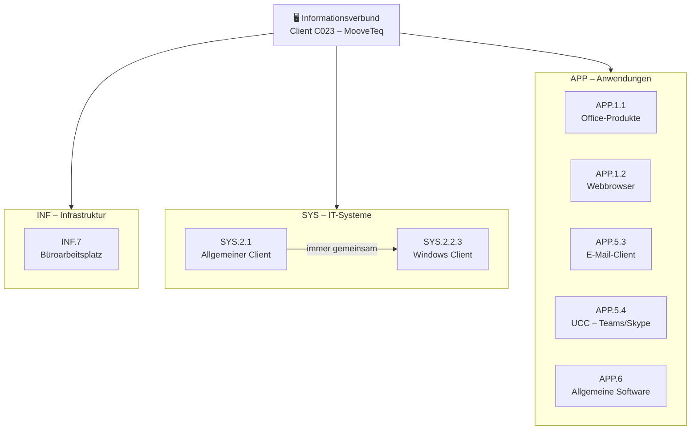
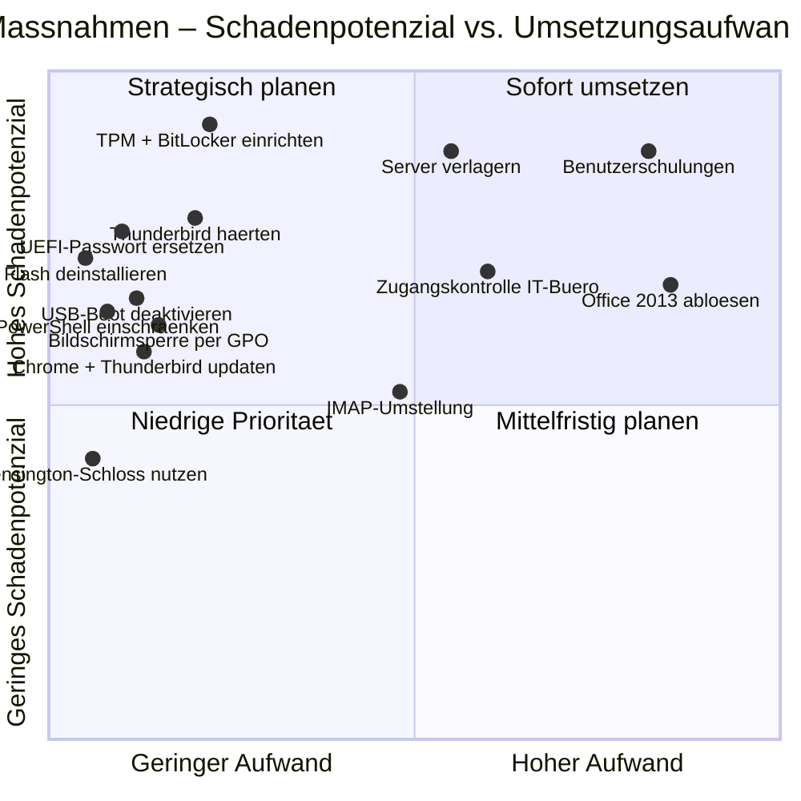

# Präsentation Diagramme – IT-Grundschutz-Check C023

---

## Folie 1 – Mindmap Schwachstellen (Kr. 2)

---

## Folie 2 – Bausteinauswahl (Kr. 4)

---

## Folie 3 – Aufbau Prüfplan (Kr. 5)

**Beispiel: APP.5.3 – Allgemeiner E-Mail-Client**

| ID | Anforderung (MUSS/SOLLTE) | Status | Umsetzung / Begründung |
|----|--------------------------|--------|------------------------|
| APP.5.3.A1 | E-Mail-Clients MÜSSEN so konfiguriert werden, dass HTML-Code und aktive Inhalte nicht automatisch interpretiert werden. | ❌ nein | Keine spezifische Thunderbird-Konfiguration dokumentiert. |
| APP.5.3.A1 | E-Mail-Clients MÜSSEN für die Kommunikation eine sichere Transportverschlüsselung einsetzen. | ❌ nein | Keine TLS-Konfiguration für Thunderbird-Konten dokumentiert. |
| APP.5.3.A3 | Der IT-Betrieb MUSS die Daten der E-Mail-Clients regelmäßig sichern. | ⚠️ teilweise | Allgemeine Datensicherung vorhanden, aber keine spezifische Regelung für lokale Thunderbird-Daten (POP3). |

---

## Folie 4 – Ergebnisse Schutzbedarfsanalyse (Kr. 6)

**INF.7 – Büroarbeitsplatz**

| Anforderung | Status | Kritischer Befund |
|-------------|--------|-------------------|
| A1: Geeigneter Büroraum | ❌ nein | Besprechungsbereich + Teeküche → Publikumsverkehr im IT-Bereich; Server ungesichert im Raum |
| A2: Fenster und Türen | ❌ nein | Keine Regelung zum Schließen/Abschließen dokumentiert |

**SYS.2.1 – Allgemeiner Client**

| Anforderung             | Status    | Kritischer Befund                                                                   |
| ----------------------- | --------- | ----------------------------------------------------------------------------------- |
| A1: Bildschirmsperre    | ❌ nein    | Keine Bildschirmsperre konfiguriert                                                 |
| A3: OS-Updates          | ❌ nein    | Updates auf maximale Verzögerung gesetzt, kein WSUS                                 |
| A6: Schadsoftwareschutz | teilweise | Avira zentral vorhanden, Vollscans und Incident Response nicht dokumentiert         |
| A8: Bootvorgang / UEFI  | teilweise | UEFI-Passwort „QwErTz" (schwach); TPM deaktiviert; USB-Boot aktiv; kein Secure Boot |
| A42: Cloud-Funktionen   | teilweise | Telemetrie auf Windows Standard; Dropbox installiert                                |

**APP.5.3 – Allgemeiner E-Mail-Client**

| Anforderung               | Status    | Kritischer Befund                                                         |
| ------------------------- | --------- | ------------------------------------------------------------------------- |
| A1: Sichere Konfiguration | teilweise | HTML-Inhalte nicht deaktiviert; keine TLS-Konfiguration dokumentiert      |
| A2: Serverbetrieb         | ❌ nein    | Keine Dokumentation zu TLS, DoS-Schutz, Relay-Schutz                      |
| A3: Datensicherung        | teilweise | POP3 → E-Mails lokal; MozBackup installiert, aber kein geregelter Einsatz |
| A4: Spam-/Virenschutz     | teilweise | Clientseitig Avira vorhanden; serverseitige Prüfung nicht dokumentiert    |

---

## Folie 5 – Maßnahmen nach Priorität (Kr. 7)

