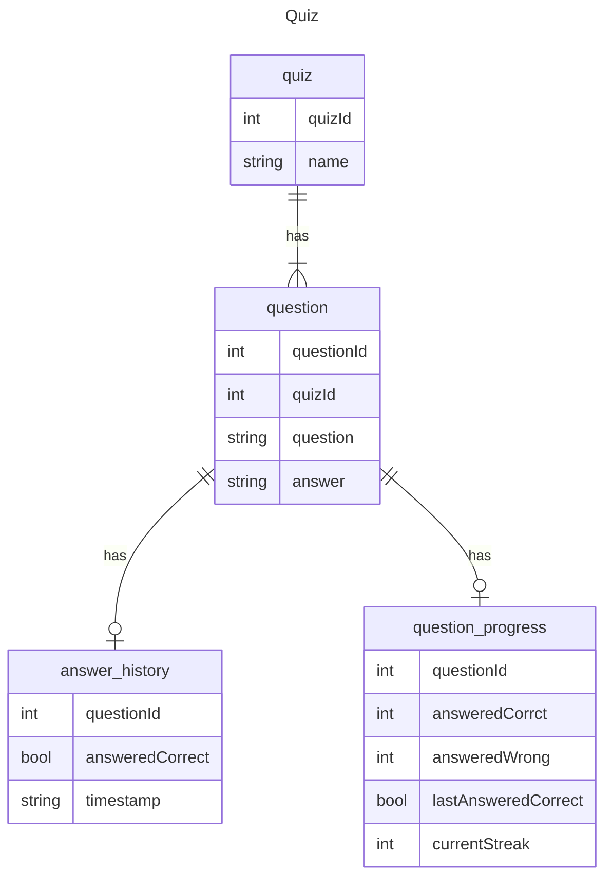

```mermaid
---
title: Quiz
---
erDiagram
	quiz {
		int quizId
		string name
	}
	
	question {
		int questionId
		int quizId
		string question
		string answer
	}
	
	answer_history {
		int questionId
		bool answeredCorrect
		string timestamp
	}
	
	question_progress {
		int questionId
		int answeredCorrct
		int answeredWrong
		bool lastAnsweredCorrect
		int currentStreak
	}
		
	quiz ||--|{ question: has
	question ||--o| answer_history: has
	question ||--o| question_progress: has
```
