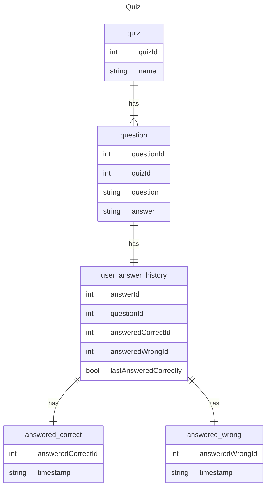

```mermaid
---
title: Quiz
---
erDiagram
	quiz {
		int quizId
		string name
	}
	
	question {
		int questionId
		int quizId
		string question
		string answer
	}
	
	user_answer_history {
		int answerId
		int questionId
		int answeredCorrectId
		int answeredWrongId
		bool lastAnsweredCorrectly
	}
	
	answered_correct {
		int answeredCorrectId
		string timestamp
	}
	
	answered_wrong {
		int answeredWrongId
		string timestamp
	}
	
	quiz ||--|{ question: has
	question ||--|| user_answer_history: has
	user_answer_history ||--|| answered_correct: has
	user_answer_history ||--|| answered_wrong: has
```
