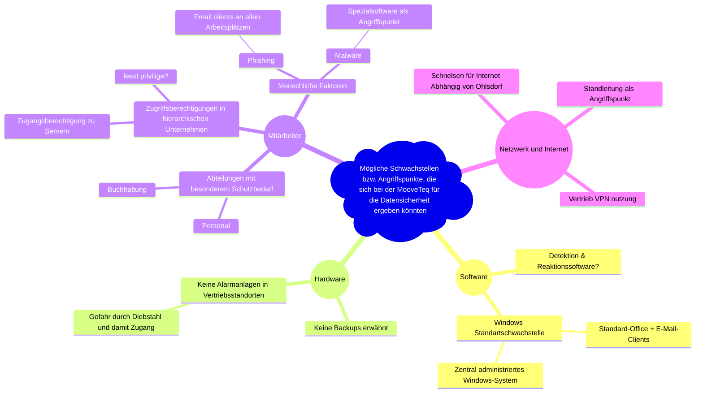

##### Ihr Handlungsauftrag:  

Informieren Sie sich im [**_Fachmodul_**](https://moodle.itech-bs14.de/course/view.php?id=1221&section=1) über mögliche Methoden zur _**Durchführung eines Brainstormings**_ und brainstormen Sie über mögliche Schwachstellen bzw. Angriffspunkte, die sich bei der MooveTeq für die Datensicherheit ergeben könnten.

Verwenden Sie das Dokument [Netzwerkplan und Unternehmensübersicht der  Firma MooveTeq GmbH](https://moodle.itech-bs14.de/mod/page/view.php?id=42596&inpopup=1) als _Ausgangspunkt_ für Ihre Überlegungen und den LinkedIn Learning-Videokurs im Fachmodul **_["Datensicherheit im Kontext von IT-Grundschutz verstehen"](https://moodle.itech-bs14.de/course/view.php?id=878)_** als _Ideenquelle_:

- Analysieren Sie den Netzwerkplan.
- Diskutieren Sie Hypothesen, wie es zum Ausfall kommen konnte.
- Finden Sie mögliche Angriffspunkte.
- Spekulieren Sie über Angreifer.  

Zur Bearbeitung notwendige Dokumente:  

- [Netzwerkplan und Unternehmensübersicht der Firma "MooveTeq GmbH"](https://moodle.itech-bs14.de/mod/page/view.php?id=42596&inpopup=1)

##### Empfohlene Fachmodule:  

- [Datensicherheit im Kontext von IT-Grundschutz verstehen](https://moodle.itech-bs14.de/course/view.php?id=878)  
- [Brainstorming-Methoden einsetzen](https://moodle.itech-bs14.de/course/view.php?id=1221&section=1)
- https://moodle.itech-bs14.de/course/view.php?id=932

Zentrale Dokumente des BSI, die Sie sich ansehen sollten

- [Materialien des BSI zum IT-Grundschutz](https://moodle.itech-bs14.de/mod/page/view.php?id=45375)
- [Beispiel-Dokumentation des IT-Grundschutz der fiktiven Firma RECAPLAST](https://moodle.itech-bs14.de/pluginfile.php/62693/mod_resource/content/1/Beschreibung%20der%20RECAPLAST%202018.pdf)
- [Check-Listen zu den IT-Grundschutz-Bausteinen](https://www.bsi.bund.de/SharedDocs/Downloads/DE/BSI/Grundschutz/IT-GS-Kompendium/checklisten_2023.html?nn=128568 "https://www.bsi.bund.de/SharedDocs/Downloads/DE/BSI/Grundschutz/IT-GS-Kompendium/checklisten_2023.html?nn=128568")

  

##### Ihr Handlungsprodukt:

Ein Dokument, das Ihr **Ergebnis des Brainstormings** in geeigneter Form und Qualität visualisiert (Mindmap, Tabelle, Fischgrätdiagramm,...).

[[Brainstorming zur Problemanalyse]]

Brainstorming
https://idea.kits.app/brainstormings/e06ae6ed-4146-4331-8dbe-cfa2a8a0c109

Mindmap
https://map.kits.app/map/e2343ab1-a174-4ca5-8520-4c44fa47c011#a4dbf606-0477-4892-8143-efc0473fd0f1

Mitarbeiter schwachstellen

Zugriffsberechtigung in Hierarchischen Unternehmen

Phishing

Malware

Internetzugang Vertrieb

VPN Nutzung Vertrieb

speziell installierte software angriffspunkt

Windows Betriebssystem Standardschwachstelle

Schnelsen für internet abhängig von Ohlsdorf

Mangelnde Detektion und Reaktionssoftware

Keine Backups erwähnt

keine alarmanlage in vertriebsstandorten

Zugangsberechtigung zu den servern

zugriff mittels authentisierung könnte 2FA sein

abteilungen mit besonderem schutzbedarf

alle geräte könnten VPN nutzen

zentral administriertes Windows system

client renchner verschlüsselter zugang zum internet

Standleitung als angriffspunkt für sensible daten
