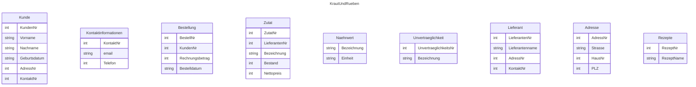
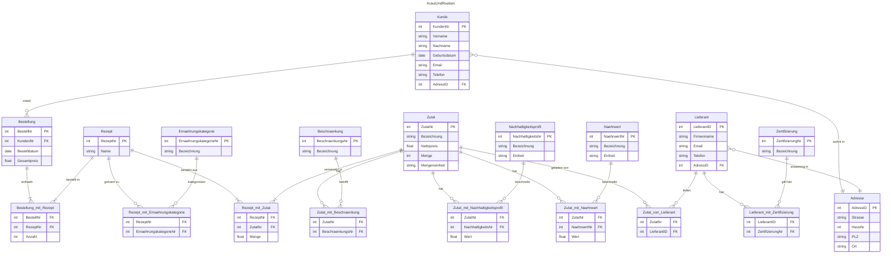

![[Screenshot 2026-04-13 at 10-15-48 IT5ANS_LF5_Kriterienraster_LN1_und_LN2_2026.xlsx - LN2_LF05_2026_ERD.pdf.png|461]]

---

---

ERD Konzept 2

Entität:

- Rezept
	- RezeptNr (PK)
	- Name

- Ernährungskategorie
	- ErnährungskategorieNr (PK)
	- Bezeichnung

- Kunde
	- KundenNr (PK)
	- AdressID (FK)
	- Vorname
	- Nachname
	- Geb. Dat.
	- Email
	- Telefon

- Bestellung
	- Bestellnr. (PK)
	- KundenNr (FK)
	- Bestelldatum
	- Gesamtpreis

- Lieferant
	- LieferantID (PK)
	- Firmenname
	- AdressID (FK)
	- Email
	- Telefon

- Zertifizierung 
	- ZertifizierungNr (PK)
	- Bezeichnung 

- Zutat
	- ZutatNr (PK)
	- Bezeichnung
	- Nettopreis
	- Bestand

- Naehrwert
	- NaehrwertNr (PK)
	- Bezeichnung 
	- Einheit 

- Nachhaltigkeitsprofil 
	- NachhaltigkeitsNr (PK)
	- Bezeichnung 
	- Einheit 

- Beschränkung
	- BeschraenkungsNr (PK)
	- Bezeichnung

- Einheit 
	- EinheitNr (PK)
	- Bezeichnung 

- Adresse
	- AdressID (PK)
	- Straße
	- HausNr
	- PLZ
	- Ort

Beziehung:

- Bestellung_mit_Rezept
	- BestellNr (FK)
	- RezeptNr (FK)
	- Anzahl

- Rezept_mit_Zutat
	- RezeptNr (FK)
	- ZutatNr (FK)
	- Menge
	- EinheitNr (FK) 

- Rezept_mit_Ernaehrungskategorie
	- RezeptNr (FK)
	- ErnährungskategorieNr (FK)

- Zutat_mit_Beschraenkung
	- ZutatNr (FK)
	- BeschraenkungsNr (FK)

- Zutat_mit_Naehrwert
	- ZutatNr (FK)
	- NaehrwertNr (FK)
	- Wert

- Zutat_mit_Nachhaltigkeitsprofil 
	- ZutatNr (FK)
	- NachhaltigkeitsNr (FK)
	- Wert

- Zutat_von_Lieferant
	- ZutatNr (FK)
	- LieferantID (FK)

- Lieferant_mit_Zertifizierung
	- LieferantID (FK)
	- ZertifizierungNr (FK)

1-1 beziehungen 
einheiten zu anderen entitäten