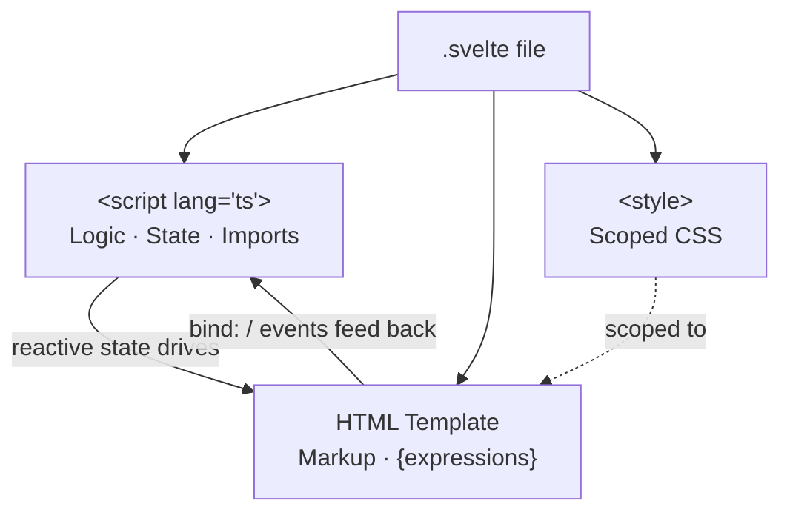

# Svelte Components

[Svelte Docs — Components](https://svelte.dev/docs/svelte/overview) | [Tutorial: Your first component](https://learn.svelte.dev/tutorial/welcome-to-svelte)

A **component** in Svelte is a `.svelte` file. It contains everything a UI unit needs: logic, markup, and styles — all in a single file.

---

## Structure of a .svelte File

```svelte
<script lang="ts">
  // JavaScript / TypeScript logic
  let name = "SAKE";
</script>

<!-- HTML markup (template) -->
<h1>Welcome to {name}</h1>
<p>A tool for GCP key rotation.</p>

<style>
  h1 {
    color: navy;
  }
</style>
```

The three sections:
- `<script>` — logic, variables, imports
- HTML section — template with `{ }` for expressions
- `<style>` — CSS, **automatically scoped** (only affects this component)



---

## Expressions in the Template

Any JavaScript expression can be embedded in the template using `{ }`:

```svelte
<script lang="ts">
  let user = "Jonas";
  let now = new Date().toLocaleDateString();
</script>

<p>Hello, {user}!</p>
<p>Today is {now}.</p>
<p>2 + 2 = {2 + 2}</p>
```

---

## Importing and Using Components

```svelte
<!-- Button.svelte -->
<button>Click me</button>
```

```svelte
<!-- App.svelte -->
<script lang="ts">
  import Button from './Button.svelte';
</script>

<Button />
```

Components are used like HTML tags. The filename becomes the tag name.

---

## Attributes and Bindings

### Static attributes
```svelte

```

### Dynamic attributes
```svelte
<script lang="ts">
  let src = "/logo.png";
  let disabled = true;
</script>


<button {disabled}>Submit</button>
```

Shorthand: if attribute name equals variable name, `{src}` is enough instead of `src={src}`.

### Two-way binding with `bind:`
```svelte
<script lang="ts">
  let value = $state("");
</script>

<input bind:value />
<p>Input: {value}</p>
```

`bind:value` synchronizes the variable with the input field in both directions.

---

## Scoped Styles

```svelte
<style>
  p {
    color: red; /* only affects <p> in this component */
  }
</style>
```

Svelte automatically adds a unique class hash so styles don't "leak" into other components. Global styles require `:global()`:

```svelte
<style>
  :global(body) {
    margin: 0;
  }
</style>
```

---

## Related Topics

- [[Svelte Reactivity (Runes)]] — how state works inside components
- [[Svelte Props and Events]] — how data flows between components
- [[TypeScript in Svelte]] — `lang="ts"` in the script tag
- [[Separation of concerns]] — the architectural principle behind putting logic, markup, and style in one file
- [[Composable function]] — Jetpack Compose equivalent: `@Composable` functions are the Android analog of `.svelte` components
