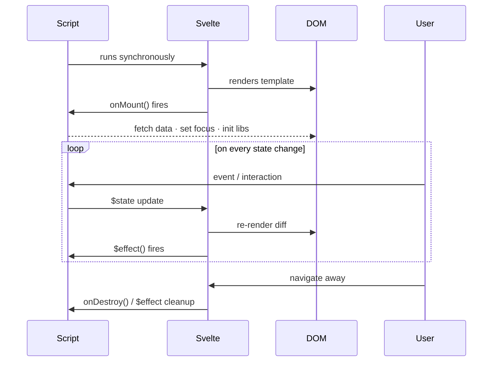

# Svelte Lifecycle

[Svelte Docs — Lifecycle](https://svelte.dev/docs/svelte/lifecycle-hooks) | [Tutorial: onMount](https://learn.svelte.dev/tutorial/onmount)

Svelte components go through a lifecycle: being created, appearing in the DOM, updating, and disappearing again. Lifecycle functions allow code to run at specific moments in this cycle.

---

## onMount — after the first render

```svelte
<script lang="ts">
  import { onMount } from 'svelte';

  let keys = $state<string[]>([]);

  onMount(async () => {
    const res = await fetch('/api/keys');
    keys = await res.json();
  });
</script>

{#each keys as key}
  <p>{key}</p>
{/each}
```

`onMount` is called **after the component has appeared in the DOM**. Perfect for:
- API calls on load
- DOM manipulation (e.g. setting focus)
- Initializing external libraries (e.g. Chart.js)

> **Important for SAKE:** The Web Crypto API (`window.crypto`) is only available in the browser. Initializing it in `onMount` ensures SSR does not throw an error — even though SAKE has `ssr = false`, it's a good habit.

### Cleanup from onMount

```svelte
<script lang="ts">
  import { onMount } from 'svelte';

  onMount(() => {
    const handler = () => console.log("Window resized");
    window.addEventListener('resize', handler);

    return () => window.removeEventListener('resize', handler); // cleanup
  });
</script>
```

The function returned from `onMount` runs on unmount (equivalent to `onDestroy`).

---

## onDestroy — when the component is removed

```svelte
<script lang="ts">
  import { onDestroy } from 'svelte';

  const interval = setInterval(() => console.log("tick"), 1000);

  onDestroy(() => {
    clearInterval(interval);
  });
</script>
```

Useful for cleaning up: canceling subscriptions, clearing intervals, removing event listeners.

---

## $effect as a lifecycle alternative

In Svelte 5, `$effect` takes over many tasks that previously required `afterUpdate`:

```svelte
<script lang="ts">
  let query = $state("");

  $effect(() => {
    // runs after every render in which `query` changed
    document.title = `Search: ${query}`;
  });
</script>
```

Comparison:

| Lifecycle | When | Svelte 5 alternative |
|---|---|---|
| `onMount` | After first DOM render | `onMount` (still recommended) |
| `onDestroy` | When component is removed | Cleanup function in `onMount` or `$effect` |
| `beforeUpdate` | Before every re-render | Rarely needed |
| `afterUpdate` | After every re-render | `$effect` |

---

## Execution order on load



---

## Example: crypto key generation on mount (SAKE context)

```svelte
<script lang="ts">
  import { onMount } from 'svelte';

  let keyPair = $state<CryptoKeyPair | null>(null);

  onMount(async () => {
    keyPair = await window.crypto.subtle.generateKey(
      { name: "RSA-OAEP", modulusLength: 2048, publicExponent: new Uint8Array([1, 0, 1]), hash: "SHA-256" },
      true,
      ["encrypt", "decrypt"]
    );
  });
</script>

{#if keyPair}
  <p>Key pair ready</p>
{:else}
  <p>Generating key pair...</p>
{/if}
```

---

## Related Topics

- [[Svelte Reactivity (Runes)]] — `$effect` as a modern lifecycle hook
- [[Fetch in Svelte]] — API calls typically in `onMount`
- [[SvelteKit Load Functions]] — alternative to onMount for data-heavy loading
- [[Composable Lifecycle]] — Jetpack Compose equivalent: `LaunchedEffect`, `DisposableEffect`, `SideEffect`
- [[Activity Lifecycle]] — Android Activity lifecycle for broader context on why lifecycle management matters
