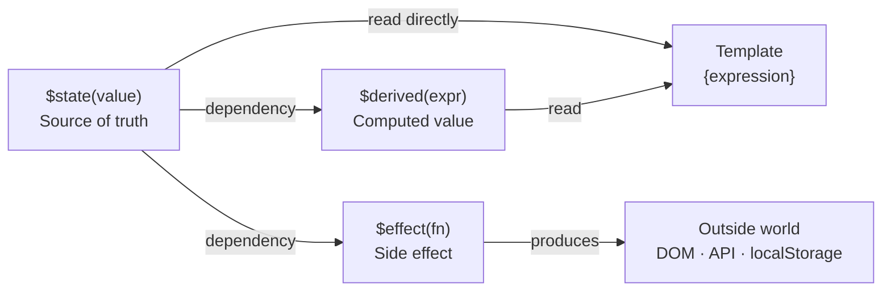

# Svelte Reactivity — Runes

[Svelte Docs — Runes](https://svelte.dev/docs/svelte/what-are-runes) | [Tutorial: State](https://learn.svelte.dev/tutorial/state)

**Runes** are special compiler directives in Svelte 5 that start with `$`. They replace the implicit reactivity system from Svelte 4. Runes look like function calls but are not real functions — the Svelte compiler understands them and translates them.

> Runes also work in plain `.ts`/`.js` files (not just `.svelte`) if the file ends in `.svelte.ts` / `.svelte.js`.

---

## $state — reactive state

```svelte
<script lang="ts">
  let count = $state(0);
</script>

<button onclick={() => count++}>
  Clicked: {count}
</button>
```

Every change to `count` automatically triggers a re-render. Compared to Svelte 4: previously `let count = 0` was enough — in Svelte 5 `$state()` must be used explicitly.

### Reactive objects and arrays

```svelte
<script lang="ts">
  let user = $state({ name: "Jonas", role: "Requester" });
  let items = $state<string[]>([]);
</script>

<p>{user.name} — {user.role}</p>
<button onclick={() => items.push("new entry")}>Add</button>
```

For objects and arrays, deeply nested changes are also detected (deep reactivity via Proxies).

---

## $derived — computed values

```svelte
<script lang="ts">
  let count = $state(0);
  let doubled = $derived(count * 2);
  let label = $derived(count === 1 ? "time" : "times");
</script>

<p>{count} × 2 = {doubled}</p>
<p>Clicked {count} {label}</p>
```

`$derived` recalculates a value whenever one of its dependencies changes. The expression must not have side effects.

### $derived.by for complex calculations

```svelte
<script lang="ts">
  let items = $state([1, 2, 3, 4, 5]);
  let total = $derived.by(() => {
    return items.reduce((sum, n) => sum + n, 0);
  });
</script>
```

---

## $effect — side effects

```svelte
<script lang="ts">
  let query = $state("");

  $effect(() => {
    console.log("Query changed:", query);
    // API calls, localStorage, etc. go here
  });
</script>
```

`$effect` runs:
1. Once after the first render
2. Again whenever a `$state` variable used inside the effect changes

### Cleanup in $effect

```svelte
<script lang="ts">
  $effect(() => {
    const interval = setInterval(() => console.log("tick"), 1000);
    return () => clearInterval(interval); // called before each re-run and on unmount
  });
</script>
```

---

## $inspect — debug logging (dev only)

```svelte
<script>
  let count = $state(0);
  $inspect(count); // logs to console whenever count changes
</script>
```

`$inspect` prints the value to the browser console every time it changes. **It is automatically stripped from production builds** — the Svelte compiler removes the line entirely when building for production. This means you can leave `$inspect` in source code without worrying about leaking debug output to users. For logging that must run in production, use a regular `console.log`.

---

## $state.raw — non-reactive values

When a large object should not be deeply observed (performance):

```svelte
<script lang="ts">
  let data = $state.raw({ large: "object" });
  // Only reassignment triggers an update, not property mutations
  data = { large: "updated" }; // ✓ reactive
  data.large = "mutated";      // ✗ no update
</script>
```

---

## How runes relate to each other



## Summary

| Rune | Purpose | When to use |
|---|---|---|
| `$state(value)` | Reactive state | Variables that change and should update the UI |
| `$derived(expr)` | Computed value | Values that depend on other state |
| `$derived.by(fn)` | Complex computation | Multiple steps, `.reduce()`, etc. |
| `$effect(fn)` | Side effects | API calls, localStorage, logging |
| `$state.raw(v)` | Non-deep-reactive | Large objects where only reassignment matters |

---

## Related Topics

- [[Svelte Components]] — where runes are used
- [[Svelte Props and Events]] — `$props()` is also a rune
- [[Svelte Stores]] — alternative for cross-component state
- [[State in Compose]] — Android equivalent: `remember { mutableStateOf() }` works similarly to `$state()`
- [[Unidirectional data Flow]] — the data-flow pattern that runes enforce: state flows down, events flow up
