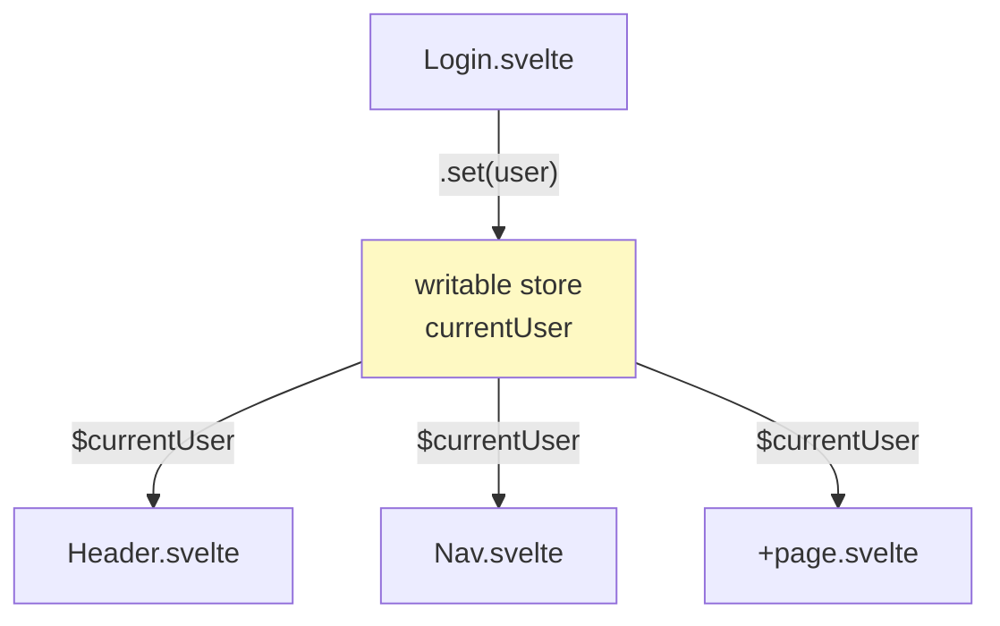

# Svelte Stores

[Svelte Docs — Stores](https://svelte.dev/docs/svelte/stores) | [Tutorial: Writable stores](https://learn.svelte.dev/tutorial/writable-stores)

A **store** is an object that holds a reactive value that can be subscribed to by **multiple components** simultaneously — independent of the component hierarchy. Stores solve the "prop drilling" problem (passing props through many levels).

Stores come from `svelte/store`.

---

## writable — writable store

```ts
// stores.ts
import { writable } from 'svelte/store';

export const currentUser = writable<string | null>(null);
export const keyList = writable<string[]>([]);
```

```svelte
<!-- Login.svelte -->
<script lang="ts">
  import { currentUser } from './stores';

  function login() {
    currentUser.set("jonas@bonprix.net");
  }
</script>

<button onclick={login}>Log in</button>
```

```svelte
<!-- Header.svelte -->
<script lang="ts">
  import { currentUser } from './stores';
</script>

{#if $currentUser}
  <p>Logged in as: {$currentUser}</p>
{/if}
```

### Store API

| Method | Description |
|---|---|
| `store.set(value)` | Sets a new value |
| `store.update(fn)` | Changes the value based on the current value |
| `store.subscribe(fn)` | Subscribes to changes (returns an unsubscribe function) |

```ts
keyList.update(keys => [...keys, "key-new-123"]);
```

---

## How stores connect components



The store is the single source of truth. Any component can write to it; any component can subscribe. No props need to pass through the tree.

## $ — Auto-subscription in Svelte files

In `.svelte` files, a store can be used directly with the `$` prefix:

```svelte
<script lang="ts">
  import { currentUser } from './stores';
  // No manual subscribe() needed!
</script>

<p>{$currentUser}</p>
```

Svelte automatically subscribes to the store and cleans up the subscription on unmount. In plain `.ts` files (without Svelte), `subscribe()` must be used manually.

---

## readable — read-only store

```ts
import { readable } from 'svelte/store';

export const timestamp = readable(new Date(), (set) => {
  const interval = setInterval(() => set(new Date()), 1000);
  return () => clearInterval(interval); // cleanup
});
```

```svelte
<script lang="ts">
  import { timestamp } from './stores';
</script>

<p>Current time: {$timestamp.toLocaleTimeString()}</p>
```

`readable` takes an initial value and a setup function. The setup function is called when the first subscriber attaches, and the returned cleanup function runs when the last subscriber unsubscribes.

---

## derived — derived store

```ts
import { derived } from 'svelte/store';
import { keyList } from './stores';

export const keyCount = derived(keyList, $keys => $keys.length);

export const expiredKeys = derived(keyList, $keys =>
  $keys.filter(k => k.isExpired)
);
```

`derived` recalculates a new value every time the source store changes. Multiple sources are supported:

```ts
export const summary = derived(
  [currentUser, keyList],
  ([$user, $keys]) => `${$user} has ${$keys.length} keys`
);
```

---

## Stores vs. $state — when to use which?

| Scenario | Recommendation |
|---|---|
| State only in one component | `$state()` |
| State passed to child components (1–2 levels) | Props + `$state()` |
| State needed by many components | Store |
| State must live in `.ts` files | Store |
| Global app data (user, auth token) | Store |

---

## Example: auth store for SAKE

```ts
// authStore.ts
import { writable, derived } from 'svelte/store';

interface User {
  email: string;
  role: "requester" | "supporter";
}

export const user = writable<User | null>(null);
export const isAuthenticated = derived(user, $user => $user !== null);
export const isSupporter = derived(user, $user => $user?.role === "supporter");
```

```svelte
<script lang="ts">
  import { isAuthenticated, isSupporter } from './authStore';
</script>

{#if $isAuthenticated}
  {#if $isSupporter}
    <SupporterView />
  {:else}
    <RequesterView />
  {/if}
{:else}
  <LoginPage />
{/if}
```

---

## Related Topics

- [[Svelte Reactivity (Runes)]] — `$state` for local state
- [[Svelte Props and Events]] — alternative to stores for simple passing
- [[Svelte Lifecycle]] — stores are often initialized in `onMount`
- [[StateFlow]] — Kotlin/Android equivalent: `StateFlow` + `collectAsState()` plays the same role as a Svelte writable store
- [[Unidirectional data Flow]] — stores enforce UDF: one source of truth, derived values, no two-way surprises
