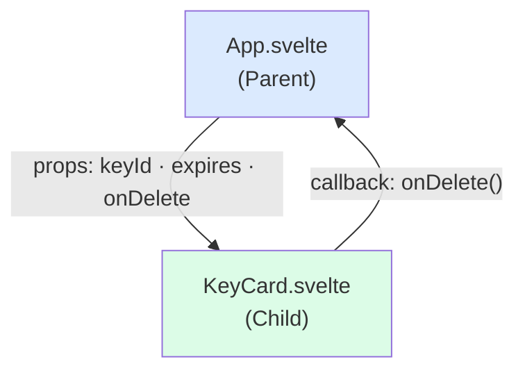

# Svelte Props and Events

[Svelte Docs — $props](https://svelte.dev/docs/svelte/$props) | [Tutorial: Props](https://learn.svelte.dev/tutorial/declaring-props)

**Props** (properties) are the way to pass data from a parent component to a child component. **Events** (in Svelte 5: plain event handlers) control communication in the other direction — from child to parent.

---

## Props with $props()

```svelte
<!-- KeyCard.svelte -->
<script lang="ts">
  let { keyId, expires, onDelete } = $props<{
    keyId: string;
    expires: string;
    onDelete: () => void;
  }>();
</script>

<div>
  <p>{keyId} — expires: {expires}</p>
  <button onclick={onDelete}>Delete</button>
</div>
```

```svelte
<!-- App.svelte -->
<script lang="ts">
  import KeyCard from './KeyCard.svelte';

  function handleDelete() {
    console.log("Key deleted");
  }
</script>

<KeyCard keyId="key-123" expires="2025-09-01" onDelete={handleDelete} />
```

### Default values for props

```svelte
<script lang="ts">
  let { title = "Unknown Key", required = false } = $props<{
    title?: string;
    required?: boolean;
  }>();
</script>
```

---

## Spreading props

```svelte
<script lang="ts">
  let { class: className, ...rest } = $props();
</script>

<button class={className} {...rest}>
  <slot />
</button>
```

`...rest` forwards all non-explicitly destructured props as HTML attributes. Useful for generic wrapper components.

---

## Bindable props with $bindable()

In Svelte 5, a component can explicitly allow a prop to be bound from outside using `bind:`:

```svelte
<!-- SearchInput.svelte -->
<script lang="ts">
  let { value = $bindable("") } = $props<{ value?: string }>();
</script>

<input bind:value />
```

```svelte
<!-- Parent component -->
<script lang="ts">
  let query = $state("");
</script>

<SearchInput bind:value={query} />
<p>Search: {query}</p>
```

---

## Events in Svelte 5

Svelte 5 uses **native DOM event handlers** instead of the old `on:` directives. These are simply attributes like `onclick`, `oninput`, `onsubmit`.

```svelte
<button onclick={() => console.log("Clicked!")}>Click me</button>

<input oninput={(e) => console.log(e.currentTarget.value)} />

<form onsubmit={(e) => { e.preventDefault(); handleSubmit(); }}>
  <button type="submit">Submit</button>
</form>
```

> **Note:** In Svelte 4 it was `on:click`, in Svelte 5 it is `onclick` (no colon, lowercase).

### Passing event handlers as props

```svelte
<!-- Button.svelte -->
<script lang="ts">
  let { onclick, label } = $props<{
    onclick: () => void;
    label: string;
  }>();
</script>

<button {onclick}>{label}</button>
```

```svelte
<!-- App.svelte -->
<Button onclick={() => alert("Clicked!")} label="Rotate key" />
```

---

## Data flow principle



Data always flows **downward** via props. Changes flow **upward** via callback functions passed as props. This is the **unidirectional data flow** pattern — the same principle used in Android Jetpack Compose and React.

---

## Related Topics

- [[Svelte Components]] — how components are structured
- [[Svelte Reactivity (Runes)]] — `$bindable()` is also a rune
- [[Svelte Stores]] — alternative when props need to be passed through many levels (prop drilling)
- [[Unidirectional data Flow]] — the pattern this follows: single source of truth, events bubble up
- [[Model-View-ViewModel]] — MVVM is a related pattern where a ViewModel holds state and the view only observes
