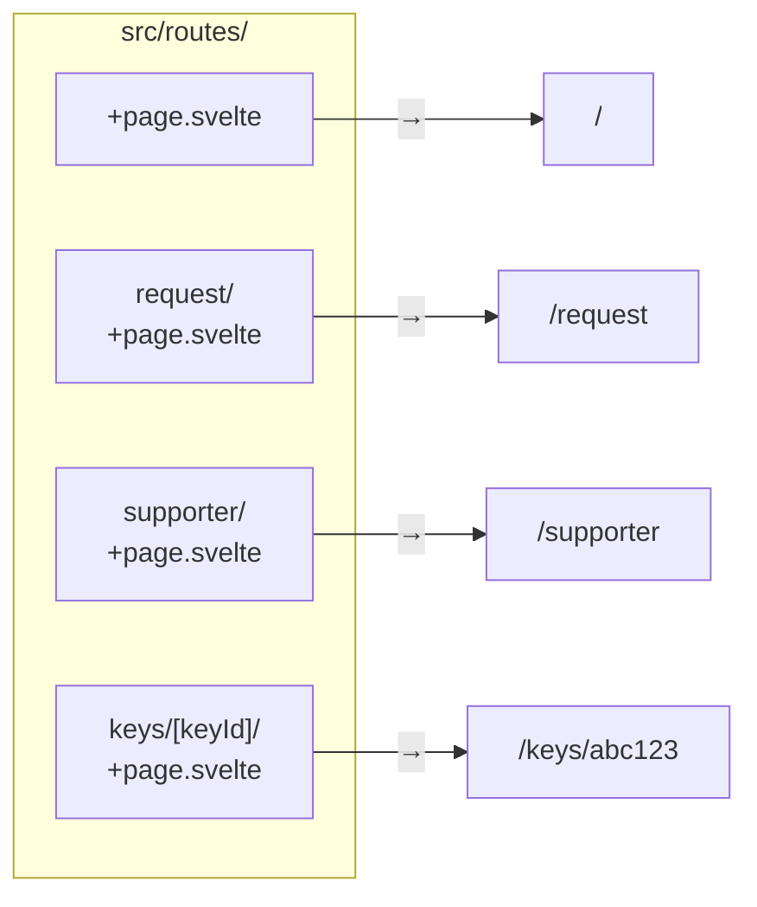

# SvelteKit Routing

[SvelteKit Docs — Routing](https://kit.svelte.dev/docs/routing) | [Tutorial: Pages](https://learn.svelte.dev/tutorial/pages)

SvelteKit uses **file-based routing**: the folder path under `src/routes/` determines the URL. No separate router configuration needed.

---

## File conventions

| File | Purpose |
|---|---|
| `+page.svelte` | The page (UI) for this route |
| `+page.ts` | Load data (client-side) for this page |
| `+page.server.ts` | Load data (server-side), form actions |
| `+layout.svelte` | Layout wrapper for this route + all sub-routes |
| `+layout.ts` | Load data for the layout |
| `+error.svelte` | Error page for this route |

---

## Basic routing



```
src/routes/
├── +page.svelte           → /
├── +layout.svelte         → layout for all pages
├── request/
│   └── +page.svelte       → /request
├── supporter/
│   └── +page.svelte       → /supporter
└── about/
    └── +page.svelte       → /about
```

---

## Layout with navigation

```svelte
<!-- src/routes/+layout.svelte -->
<script lang="ts">
  let { children } = $props();
</script>

<nav>
  <a href="/">Home</a>
  <a href="/request">Request key</a>
  <a href="/supporter">Supporter</a>
</nav>

<main>
  {@render children()}
</main>

<style>
  nav { display: flex; gap: 1rem; padding: 1rem; }
</style>
```

`{@render children()}` is the placeholder for the content of the respective page. (Svelte 5 syntax — in Svelte 4 it was `<slot />`.)

---

## Dynamic routes

```
src/routes/
└── keys/
    ├── +page.svelte           → /keys
    └── [keyId]/
        └── +page.svelte       → /keys/abc123
```

```svelte
<!-- src/routes/keys/[keyId]/+page.svelte -->
<script lang="ts">
  import { page } from '$app/stores';

  let keyId = $derived($page.params.keyId);
</script>

<h1>Key detail: {keyId}</h1>
```

### Multiple segments

```
src/routes/org/[orgId]/project/[projectId]/+page.svelte
→ /org/bpde/project/key-rotation
```

---

## Navigation

```svelte
<script lang="ts">
  import { goto } from '$app/navigation';

  async function afterSubmit() {
    await goto('/success');                          // navigate programmatically
    await goto('/keys', { replaceState: true });     // without browser history entry
  }
</script>

<!-- Declarative -->
<a href="/request">Request key</a>
```

### $page store

```svelte
<script lang="ts">
  import { page } from '$app/stores';
</script>

<p>Current URL: {$page.url.pathname}</p>
<p>Route param: {$page.params.keyId}</p>
<p>Query: {$page.url.searchParams.get('q')}</p>
```

---

## Nested layouts

```
src/routes/
├── +layout.svelte              ← root layout (nav, footer)
├── +page.svelte                ← /
└── admin/
    ├── +layout.svelte          ← admin layout (sidebar)
    ├── +page.svelte            ← /admin
    └── users/
        └── +page.svelte        ← /admin/users
```

Admin pages receive both layouts. The admin layout is nested inside the root layout.

---

## Route groups

```
src/routes/
├── (public)/
│   ├── +layout.svelte      ← layout for public pages
│   ├── +page.svelte        → /
│   └── about/
│       └── +page.svelte    → /about
└── (protected)/
    ├── +layout.svelte      ← layout with auth check
    ├── request/
    │   └── +page.svelte    → /request
    └── supporter/
        └── +page.svelte    → /supporter
```

Parentheses `()` in a folder name create a route group — the name does **not** appear in the URL. Useful for grouping pages without affecting the URL.

---

## Highlighting active links

```svelte
<script lang="ts">
  import { page } from '$app/stores';

  function isActive(href: string) {
    return $page.url.pathname === href;
  }
</script>

<a href="/request" class:active={isActive('/request')}>Request key</a>

<style>
  .active { font-weight: bold; border-bottom: 2px solid currentColor; }
</style>
```

---

## Related Topics

- [[SvelteKit]] — overview and project structure
- [[SvelteKit Load Functions]] — loading data for pages
- [[Svelte Props and Events]] — `children` prop in layouts
- [[Navigation]] — Android Jetpack Navigation: NavHost/NavController is the Android analog of SvelteKit's file-based routing
