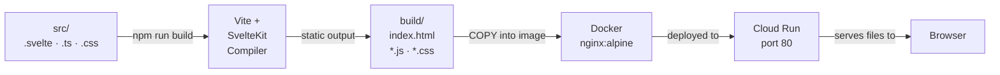

# SvelteKit Static Adapter

[SvelteKit Docs — adapter-static](https://kit.svelte.dev/docs/adapter-static) | [Docs — Prerendering](https://kit.svelte.dev/docs/page-options#prerender)

The **static adapter** (`@sveltejs/adapter-static`) builds a SvelteKit app as **pure static files** (HTML, CSS, JavaScript) — no Node.js server needed at runtime. The output can be hosted on any web server that serves static files.

> **SAKE uses exactly this:** The SvelteKit app is built as static files and hosted in an Nginx Docker container on Cloud Run.

---

## Configuration

### Installation
```bash
npm install -D @sveltejs/adapter-static
```

### svelte.config.js
```js
import adapter from '@sveltejs/adapter-static';
import { vitePreprocess } from '@sveltejs/vite-plugin-svelte';

export default {
  preprocess: vitePreprocess(),
  kit: {
    adapter: adapter({
      pages: 'build',          // output folder for HTML pages
      assets: 'build',         // output folder for assets
      fallback: 'index.html',  // for client-side routing (SPA mode)
      precompress: false,       // pre-compress with gzip/brotli?
    })
  }
};
```

### src/routes/+layout.ts
```ts
// Disable SSR for the entire app
export const ssr = false;
export const prerender = true;
```

These two lines are **central** to the SPA mode with the static adapter.

---

## What do ssr and prerender mean?

| Option | Meaning |
|---|---|
| `ssr = true` (default) | Server renders HTML → requires a running server |
| `ssr = false` | No server rendering → app runs in the browser only |
| `prerender = true` | Pages are built into static HTML at build time |
| `prerender = false` | Pages render dynamically (with `ssr = false`: in the browser) |

**SAKE combination** (`ssr = false` + `prerender = true` + `fallback = 'index.html'`):
- One `index.html` is built
- The browser takes over routing and rendering entirely
- Nginx always returns `index.html`, SvelteKit router handles the rest

---

## What happens during npm run build?



```
npm run build
         ↓
    Vite + SvelteKit
         ↓
    build/
    ├── index.html          ← shell HTML
    ├── _app/
    │   ├── immutable/
    │   │   ├── *.js        ← compiled JavaScript
    │   │   └── *.css       ← compiled CSS (including Tailwind)
    │   └── chunks/
    └── favicon.png
```

These files are copied into the Docker container and served by Nginx.

---

## Nginx configuration for SPA

Since all routes should fall back to `index.html`:

```nginx
server {
    listen 80;
    root /usr/share/nginx/html;
    index index.html;

    location / {
        try_files $uri $uri/ /index.html;
    }
}
```

Without `try_files`, Nginx would return a 404 for `/request` because no file `/request/index.html` exists.

---

## Dockerfile for SAKE-style deployment

```dockerfile
FROM node:20-alpine AS builder
WORKDIR /app
COPY package*.json .
RUN npm ci
COPY . .
RUN npm run build

FROM nginx:alpine
COPY --from=builder /app/build /usr/share/nginx/html
COPY nginx.conf /etc/nginx/conf.d/default.conf
EXPOSE 80
```

---

## Static adapter limitations

| Feature | Available? |
|---|---|
| Client-side fetch | ✓ |
| `+page.ts` (load) | ✓ |
| `$env/static/public` | ✓ |
| `+page.server.ts` | ✗ (no server) |
| `+server.ts` (API routes) | ✗ (no server) |
| `$env/static/private` | ✗ (no server) |
| Server-side cookies | ✗ |

Since SAKE needs no server functions (GCP API calls directly in the browser via the supporter's Google login), the static adapter is ideal.

---

## Related Topics

- [[SvelteKit]] — overview and configuration files
- [[SvelteKit Load Functions]] — what works in load functions with `ssr = false`
- [[SvelteKit Routing]] — how routing works in SPA mode
- [[Docker]] — the containerization tool used to package the Nginx static server
- [[Google Cloud]] — Cloud Run is the GCP service that hosts the Docker container
