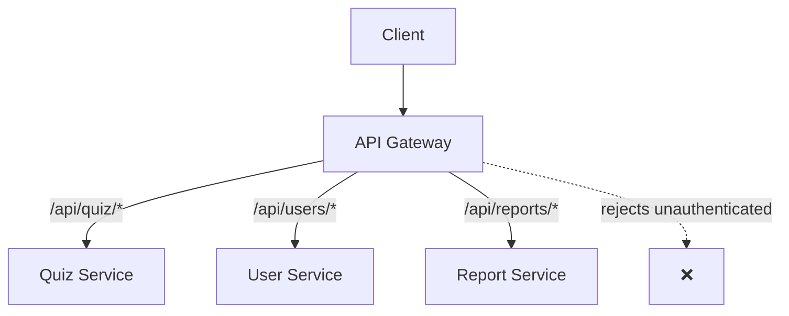

# API Gateway

[AWS API Gateway Docs](https://docs.aws.amazon.com/apigateway/) | [Kong API Gateway](https://docs.konghq.com/gateway/latest/)

An API Gateway is a managed entry point that sits in front of backend services and handles cross-cutting concerns — authentication, routing, rate limiting, logging — so individual services don't have to implement them independently.

---

## The Problem

Without an API Gateway, each backend service must independently handle:
- SSL termination
- Authentication / authorisation
- Rate limiting
- Logging
- Request routing

This creates duplication and inconsistency across services. The API Gateway centralises these concerns.

---

## Architecture



Clients talk to one address. The gateway handles the rest.

---

## Core Responsibilities

| Responsibility | What it does |
|---|---|
| **Routing** | Directs requests to the correct backend service by path, host, or header |
| **Authentication** | Validates JWT tokens, API keys, or OAuth before reaching the backend |
| **Rate limiting** | Blocks or throttles clients sending too many requests |
| **SSL termination** | Handles HTTPS; backend services receive plain HTTP internally |
| **Request transformation** | Reshapes request/response payloads (add headers, strip fields) |
| **Caching** | Returns cached responses for repeated identical requests |
| **Logging & tracing** | Records all requests for [[Observability]] |

---

## Request Lifecycle

```
Client Request
      ↓
1. SSL termination
2. Authentication check  → reject if invalid
3. Rate limit check      → reject if exceeded
4. Route to backend
5. (optional) Transform response
6. Return to client
      ↓
Client Response
```

---

## API Gateway vs Load Balancer

| API Gateway | Load Balancer |
|---|---|
| Routes to **different services** by logic | Distributes to **identical instances** of one service |
| Handles auth, rate limiting, transformation | Networking only |
| Higher overhead | Lower overhead |
| HTTP/REST/GraphQL focused | TCP/HTTP traffic |

They complement each other: API Gateway in front for API management, [[Load Balancer]] behind for horizontal scaling.

---

## Gateway vs Service Mesh

| API Gateway | Service Mesh (e.g. Istio) |
|---|---|
| North-south traffic (external → internal) | East-west traffic (service → service) |
| One entry point | Sidecar proxy on every service |
| Coarser-grained control | Fine-grained per-service policies |

---

## Common Implementations

| Type | Examples |
|---|---|
| Cloud managed | AWS API Gateway, Google Cloud API Gateway, Azure API Management |
| Self-hosted | Kong, Traefik, NGINX, Envoy |
| [[Kubernetes]] native | Ingress controllers (NGINX Ingress, Traefik), Gateway API |

---

## Related Topics

- [[Load Balancer]] — sits behind the API Gateway to scale individual backend services
- [[Serverless]] — API Gateway + serverless function (e.g. AWS Lambda) is the canonical serverless HTTP stack
- [[Observability]] — all requests flow through the gateway, making it the ideal place to collect telemetry
- [[Messaging Patterns]] — API Gateway can trigger async processing by publishing to a queue on receipt of a request
