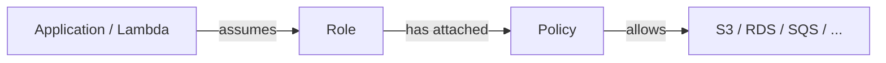

# AWS IAM

[AWS IAM Documentation](https://docs.aws.amazon.com/IAM/latest/UserGuide/) | [IAM Best Practices](https://docs.aws.amazon.com/IAM/latest/UserGuide/best-practices.html)

AWS Identity and Access Management (IAM) controls who can authenticate to AWS and what actions they are authorised to perform. Every API call in AWS is checked against IAM before it is executed.

> **Relevance:** Any AWS deployment — including Kwizz's backend infrastructure — requires IAM to grant services access to resources like S3, RDS, or SQS.

---

## Core Concepts

### User
A permanent identity representing a person or application. Has long-lived credentials (password, access keys). Use sparingly — prefer Roles for service-to-service access.

### Role
A temporary identity that can be **assumed** by a service, Lambda function, EC2 instance, or another AWS account. Credentials are short-lived and rotated automatically. Preferred over Users for application access.

### Policy
A JSON document defining what is **Allowed** or **Denied**. Attached to Users, Roles, or Groups.

```json
{
  "Version": "2012-10-17",
  "Statement": [
    {
      "Effect": "Allow",
      "Action": ["s3:GetObject", "s3:PutObject"],
      "Resource": "arn:aws:s3:::kwizz-files/*"
    }
  ]
}
```

### Group
A collection of Users that share the same policies. Simplifies managing permissions for teams.

---

## IAM Flow



---

## Principle of Least Privilege

**Only grant the exact permissions needed — nothing more.**

```
Bad:  "Action": ["*"]           ← full access to everything
Good: "Action": ["s3:GetObject"] on a specific bucket
```

Overly permissive policies are one of the most common causes of cloud security breaches.

---

## IAM vs Resource Policies

| IAM Policy | Resource Policy |
|---|---|
| Attached to an identity (User/Role) | Attached to a resource (S3 bucket, SQS queue) |
| Controls what that identity can do | Controls who can access that resource |
| Applied everywhere | Applied only to that resource |

Both can be in effect simultaneously — access is allowed only if **both** permit it (or neither explicitly denies it).

---

## Common Patterns

**Lambda accessing S3:**
1. Create IAM Role `kwizz-lambda-role`
2. Attach policy: `Allow s3:GetObject on arn:aws:s3:::kwizz-files/*`
3. Assign the Role to the Lambda function
4. Lambda automatically receives temporary credentials — no hardcoded secrets

**Deny by default:**
IAM denies all actions by default. Access must be explicitly granted. An explicit `Deny` always overrides any `Allow`.

---

## Security Best Practices

| Practice | Reason |
|---|---|
| Never use root account for daily work | Root has unrestricted access; compromise is catastrophic |
| Enable MFA on all human users | Protects against credential theft |
| Prefer Roles over long-lived access keys | Automatic credential rotation |
| Use IAM Access Analyzer | Detects overly permissive policies automatically |
| Rotate access keys regularly | Limits exposure window if keys are leaked |

---

## Related Topics

- [[AWS VPC]] — IAM controls identity; VPC controls network access — both are needed for a secure deployment
- [[AWS Lambda]] — Lambda functions assume IAM Roles to access other AWS services
- [[AWS EC2]] — EC2 instances can be assigned instance profiles (IAM Roles)
- [[Observability]] — CloudTrail logs every IAM action for audit purposes
