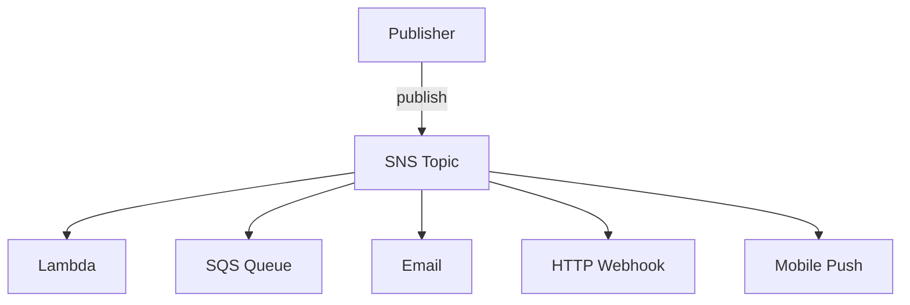

# AWS SNS

[AWS SNS Documentation](https://docs.aws.amazon.com/sns/) | [SNS Best Practices](https://docs.aws.amazon.com/sns/latest/dg/sns-best-practices.html)

Simple Notification Service (SNS) is AWS's managed pub/sub messaging service. A publisher sends one message to a topic; SNS delivers it to all subscribers simultaneously. See [[Messaging Patterns]] for the general pub/sub concept.

---

## How It Works

1. Create a **Topic** (a named channel)
2. **Subscribers** register to the topic
3. **Publisher** sends a message to the topic
4. SNS immediately delivers to **all subscribers** in parallel



---

## Subscriber Types

| Subscriber | Use case |
|---|---|
| **[[AWS Lambda\|Lambda]]** | Trigger a function on every event |
| **[[AWS SQS\|SQS Queue]]** | Buffer events for reliable async processing (fan-out) |
| **HTTP/HTTPS endpoint** | Deliver to a webhook |
| **Email** | Alert a person |
| **SMS** | Text message notification |
| **Mobile Push** | iOS / Android push notification (via APNS, FCM) |

---

## Message Filtering

Subscribers can attach a **filter policy** so they only receive relevant messages — avoiding the need to process and discard unwanted events:

```json
{
  "event_type": ["payment.completed", "payment.failed"]
}
```

A subscriber with this filter only receives messages where `event_type` matches. All other messages on the topic are ignored by that subscriber.

---

## Fan-Out Pattern

The canonical SNS + SQS combination:

```
SNS Topic: order-events
    ↓ (fan-out)
SQS Queue → Lambda (update rankings)
SQS Queue → Lambda (award badges)
SQS Queue → Lambda (log analytics)
```

**Why add SQS between SNS and Lambda?**
- Messages persist in the queue if Lambda is throttled or down
- Each consumer has independent retry and DLQ configuration
- Lambda auto-scaling is driven by queue depth, not raw SNS throughput

---

## SNS vs SQS

| SNS | SQS |
|---|---|
| Pub/sub — all subscribers get the message | Queue — one consumer gets each message |
| Push-based | Pull-based (consumer polls) |
| No persistence — delivery attempted once | Messages persist up to 14 days |
| Broadcasting | Task distribution |

---

## SNS vs EventBridge

| SNS | AWS EventBridge |
|---|---|
| Simple pub/sub | Fully managed event bus with schema registry |
| Basic content-based filtering | Advanced routing rules (pattern matching, transformation) |
| Lower cost for high throughput | Better for complex event routing across many services |
| Well-suited for fan-out | Well-suited for [[Saga Pattern\|choreography sagas]] |

---

## FIFO Topics

SNS also offers **FIFO Topics** (paired with SQS FIFO queues) for strict ordering and exactly-once delivery — use when event order matters.

---

## Related Topics

- [[AWS SQS]] — combine with SNS for the fan-out pattern; SQS adds persistence and retry
- [[Messaging Patterns]] — SNS implements the pub/sub and fan-out patterns
- [[AWS Lambda]] — Lambda subscribes to SNS topics for event-driven processing
- [[Saga Pattern]] — SNS topics serve as the topic bus in choreography-based sagas
- [[AWS IAM]] — SNS topic access and publish permissions are controlled by IAM
