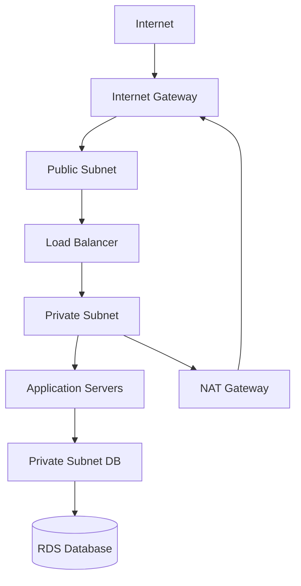

# AWS VPC

[AWS VPC Documentation](https://docs.aws.amazon.com/vpc/latest/userguide/) | [VPC Best Practices](https://docs.aws.amazon.com/vpc/latest/userguide/vpc-security-best-practices.html)

A Virtual Private Cloud (VPC) is an isolated, private network within AWS. Every resource you deploy (EC2, Lambda, RDS) runs inside a VPC. You control what is reachable from the internet and what is internal-only.

> **Relevance:** Any production AWS deployment for Kwizz would use a VPC to ensure the database is never exposed to the internet.

---

## Core Components

### Subnet
A segment of the VPC's IP address range, tied to one Availability Zone.

| Subnet type | Connected to internet? | Typical contents |
|---|---|---|
| **Public** | Yes (via Internet Gateway) | Load balancers, bastion hosts |
| **Private** | No (optionally via NAT) | Application servers, databases |

### Internet Gateway
The door between the VPC and the public internet. Required for any resource that needs to be reachable from outside AWS.

### NAT Gateway
Allows resources in a **private subnet** to make outbound internet requests (e.g. download packages, call external APIs) without being reachable from the internet inbound.

### Security Group
A stateful firewall at the **resource level** (individual EC2, Lambda, RDS). Defines allowed inbound and outbound traffic by port, protocol, and source.

```
Security Group: kwizz-backend
  Inbound:  port 8080 from Load Balancer SG only
  Outbound: port 5432 to RDS SG only
```

### Route Table
Controls where network traffic is directed within the VPC. Each subnet is associated with a route table.

---

## Typical Production Architecture



The database is only reachable from the application servers — never from the internet.

---

## VPC Peering and PrivateLink

**VPC Peering:** Connects two VPCs so resources can communicate privately without going through the internet. Used to connect production and staging VPCs, or to connect VPCs across accounts.

**AWS PrivateLink:** Allows access to AWS services (S3, SQS, etc.) from within a VPC without traffic leaving the AWS network. Uses **VPC Endpoints**.

---

## Security Layers in a VPC

| Layer | Mechanism | Scope |
|---|---|---|
| Network ACL | Stateless, subnet-level firewall | Entire subnet |
| Security Group | Stateful, resource-level firewall | Individual resource |
| Route Table | Controls traffic routing | Subnet |
| [[IAM]] | Identity-based access control | API calls |

Multiple layers work together — a request must pass all of them.

---

## Key Design Principles

- **Default: everything private.** Only expose to the internet what absolutely must be public.
- **Separate subnets by tier:** public (edge), private (app), private (data).
- **Use Security Groups as references:** instead of IP ranges, reference other Security Groups (`allow traffic from Load Balancer SG`). More maintainable as IPs change.
- **Availability Zones:** spread subnets across multiple AZs for high availability.

---

## Related Topics

- [[AWS IAM]] — VPC controls network access; IAM controls identity access — both required
- [[AWS EC2]] — EC2 instances are always launched into a VPC subnet
- [[AWS Lambda]] — Lambda can optionally run inside a VPC to access private resources
- [[Load Balancer]] — sits in the public subnet as the internet-facing entry point
