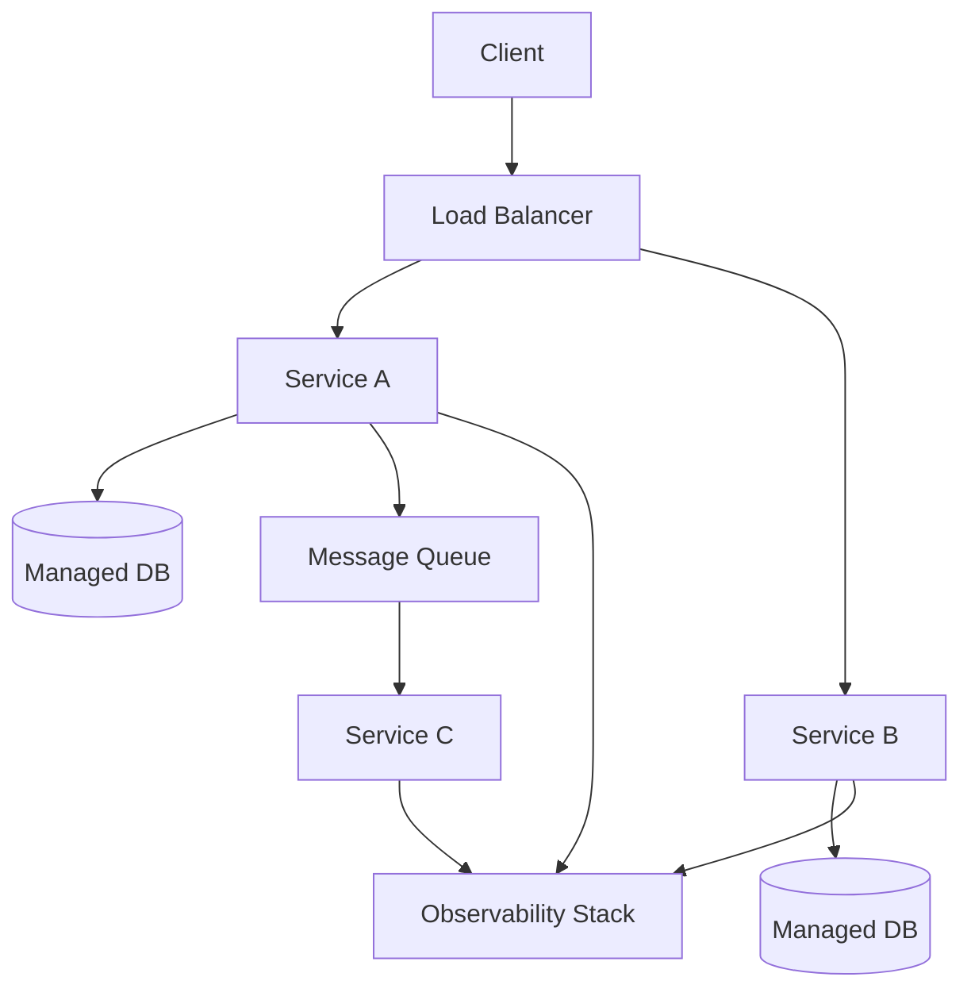

# Cloud Native

[CNCF Cloud Native Definition](https://github.com/cncf/toc/blob/main/DEFINITION.md) | [12-Factor App](https://12factor.net/)

Cloud native describes applications that are **designed from the ground up to exploit cloud infrastructure** — not just hosted there. The goal is scalability, resilience, and operational automation.

---

## Cloud Native vs Lift and Shift

| Lift and Shift | Cloud Native |
|---|---|
| Existing app moved to a cloud VM unchanged | App built to actively use cloud capabilities |
| Manual scaling, manual restarts | Auto-scaling, self-healing |
| You manage OS, runtime, patching | Managed services handle infrastructure |
| Monolithic deployment | Independently deployable services |
| Works, but misses the point of cloud | Fully exploits elasticity and managed services |

> Lift and shift is putting a diesel engine in an electric car chassis — it runs, but you're not using the platform.

---

## Core Principles

### Microservices
Break the application into small, independently deployable services — each responsible for one bounded domain. Services communicate over APIs or message buses.

### Containers
Package each service with its runtime in a [[docker|container]]. Ensures consistency between development, staging, and production environments.

### Orchestration
Use a platform like [[Kubernetes]] to manage containers at scale — scheduling, scaling, restarting failed instances, service discovery.

### Managed Services
Replace self-managed infrastructure with provider-managed equivalents:
- Self-managed PostgreSQL → managed database service
- Self-managed file storage → object storage (S3, GCS)
- Self-managed message broker → managed queue service

Reduces operational overhead; provider handles backups, patches, HA.

### Infrastructure as Code (IaC)
Define all infrastructure (servers, networks, databases) in version-controlled config files or code. Changes go through the same review process as application code.

```yaml
# Example: declarative infrastructure definition (Terraform style)
resource "aws_db_instance" "main" {
  engine         = "postgres"
  instance_class = "db.t3.micro"
  allocated_storage = 20
}
```

### Observability
Instrument services to emit logs, metrics, and traces. A cloud-native system is designed to be monitored and debugged through its telemetry, not by SSH-ing into a server.

### CI/CD
Automated build, test, and deployment pipelines. Cloud-native teams deploy frequently — the infrastructure is designed for it.

---

## The 12-Factor App

A widely referenced set of principles for building cloud-native applications:

| Factor | Principle |
|---|---|
| Codebase | One codebase, many deploys |
| Dependencies | Explicitly declare all dependencies |
| Config | Store config in environment variables |
| Backing services | Treat databases, queues etc. as attached resources |
| Build/release/run | Strictly separate build and run stages |
| Processes | Execute as stateless processes |
| Port binding | Export services via port binding |
| Concurrency | Scale out via the process model |
| Disposability | Fast startup and graceful shutdown |
| Dev/prod parity | Keep environments as similar as possible |
| Logs | Treat logs as event streams |
| Admin processes | Run admin tasks as one-off processes |

---

## Architecture diagram



---

## Related Topics

- [[Serverless]] — one cloud-native compute model; eliminates server management entirely
- [[Kubernetes]] — the dominant container orchestration platform for cloud-native workloads
- [[docker]] — the standard container format underpinning cloud-native deployments
- [[Observability]] — essential companion to cloud-native: if you can't observe it, you can't operate it
- [[Messaging Patterns]] — event-driven communication between microservices
