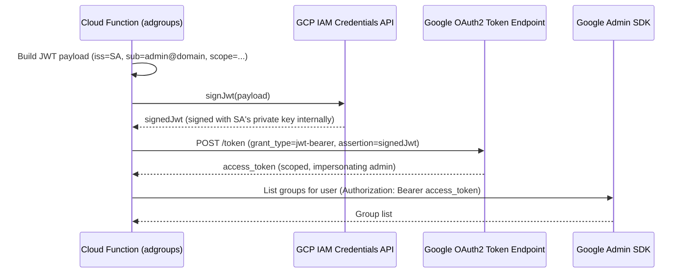

# Domain-Wide Delegation

[GCP Docs — Domain-Wide Delegation](https://cloud.google.com/iam/docs/service-account-overview#impersonation) | [Admin SDK — DWD](https://developers.google.com/admin-sdk/directory/v1/guides/delegation)

Domain-Wide Delegation (DWD) lets a GCP service account impersonate any user in a Google Workspace domain to call Google APIs (Admin SDK, Gmail, Calendar, etc.) on their behalf. It is used when a backend service needs to act as a specific user or admin — without that user being present to grant OAuth consent.

> **Relevance:** Used in the SAKE `adgroups` Cloud Function to query Google Workspace group memberships via the Admin SDK Directory API, impersonating the admin user `stephan.jauernick@bonprix.net`.

---

## Standard DWD (with private key) vs. signJwt (keyless)

Standard DWD requires downloading a service account JSON key, storing it somewhere, and signing JWTs locally. The keyless alternative uses the **IAM Credentials `signJwt` API** — GCP signs the JWT on the server side, so no private key ever leaves GCP.

| | Standard DWD | signJwt (keyless) |
|---|---|---|
| Private key required | Yes (JSON key file) | No |
| Signing happens | Locally in code | GCP IAM Credentials API |
| Required IAM role | — | `roles/iam.serviceAccountTokenCreator` on itself |
| Security posture | Key must be stored/rotated | No secret to manage |

---

## How signJwt-based DWD works



---

## Code example (Python)

```python
import json, time, requests
from googleapiclient.discovery import build
import google.auth

# Step 1 — get the current SA's email from metadata
_, project = google.auth.default()
credentials, _ = google.auth.default(
    scopes=["https://www.googleapis.com/auth/iam"]
)
iam_creds = build("iamcredentials", "v1", credentials=credentials)
service_account_email = "adgroups@bpde-dev-key-rotation.iam.gserviceaccount.com"

# Step 2 — build the JWT payload
now = int(time.time())
jwt_payload = {
    "iss": service_account_email,
    "sub": "stephan.jauernick@bonprix.net",  # admin to impersonate
    "scope": "https://www.googleapis.com/auth/admin.directory.group.readonly",
    "aud": "https://oauth2.googleapis.com/token",
    "exp": now + 3600,
    "iat": now,
}

# Step 3 — sign the JWT via IAM (no private key needed locally)
signed = iam_creds.projects().serviceAccounts().signJwt(
    name=f"projects/-/serviceAccounts/{service_account_email}",
    body={"payload": json.dumps(jwt_payload)},
).execute()

# Step 4 — exchange signed JWT for OAuth2 access token
token_response = requests.post(
    "https://oauth2.googleapis.com/token",
    data={
        "grant_type": "urn:ietf:params:oauth2:grant-type:jwt-bearer",
        "assertion": signed["signedJwt"],
    },
)
access_token = token_response.json()["access_token"]

# Step 5 — call Admin SDK with the impersonated token
headers = {"Authorization": f"Bearer {access_token}"}
groups = requests.get(
    f"https://admin.googleapis.com/admin/directory/v1/groups?userKey={user_email}",
    headers=headers,
).json()
```

---

## Prerequisites

1. **Enable DWD** in Google Workspace Admin Console:
   - Security → API Controls → Domain-wide Delegation
   - Add the service account's **Client ID** (numeric) with the required OAuth scopes

2. **Grant `roles/iam.serviceAccountTokenCreator`** on the SA (for keyless signJwt):
   ```hcl
   resource "google_service_account_iam_member" "self_sign" {
     service_account_id = google_service_account.adgroups.name
     role               = "roles/iam.serviceAccountTokenCreator"
     member             = "serviceAccount:${google_service_account.adgroups.email}"
   }
   ```

3. The **impersonated user** (`sub`) must be a Workspace admin with access to the requested API scope.

---

## Summary

| Concept | Detail |
|---|---|
| Purpose | Service account acts as any Workspace user |
| Config location | Google Workspace Admin Console (not GCP) |
| Keyless signing | `iamcredentials.projects.serviceAccounts.signJwt` |
| Required role (keyless) | `roles/iam.serviceAccountTokenCreator` on itself |
| Token type returned | Short-lived OAuth2 access token |
| Common use cases | Admin SDK (groups, users, calendar), Gmail API |

---

## Related Topics

- [[Cloud Functions Gen2]] — the `adgroups` function that uses signJwt DWD
- [[Workload Identity Federation]] — related keyless auth pattern for CI/CD
- [[Service Account Key Rotation]] — SAKE project context where adgroups is deployed
- [[IAM]] — IAM roles required to enable keyless signing
- [[GoogleCloud]] — GCP platform overview
