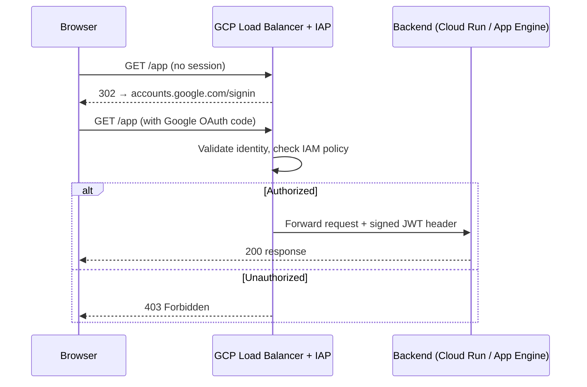

# Identity-Aware Proxy (IAP)

[GCP Docs — IAP](https://cloud.google.com/iap/docs/concepts-overview) | [IAP for Cloud Run](https://cloud.google.com/iap/docs/enabling-cloud-run)

IAP is a GCP service that enforces Google identity-based access control at the load balancer level — before a request reaches the application. Instead of writing auth code in the app, IAP intercepts every request, verifies the caller's Google identity, and checks an IAM policy. Unauthenticated requests are redirected to Google Login; unauthorized identities get a 403.

> **Relevance:** Used in the SAKE (`wip-gcp-project-key-rotation`) webapp to restrict access to `@bonprix.net` accounts without any auth logic in the SvelteKit app itself.

---

## How it works

IAP sits between the external load balancer and the backend (Cloud Run, GCE, App Engine). The flow for every request:



IAP injects a signed `X-Goog-IAP-JWT-Assertion` header into forwarded requests. The app can optionally verify this header to trust the caller's identity without doing its own OAuth flow.

---

## IAM binding — who gets access

Access is controlled by granting `roles/iap.httpsResourceAccessor` on the backend service resource:

```hcl
# Terraform — grant all @bonprix.net Google accounts access
resource "google_iap_web_backend_service_iam_member" "sake_iap" {
  project             = var.project_id
  web_backend_service = google_compute_backend_service.sake.name
  role                = "roles/iap.httpsResourceAccessor"
  member              = "domain:bonprix.net"
}
```

Other valid `member` formats:

| Format | Example |
|---|---|
| Single user | `user:alice@example.com` |
| Google Group | `group:devs@example.com` |
| Entire domain | `domain:bonprix.net` |
| Service account | `serviceAccount:sa@project.iam.gserviceaccount.com` |
| All authenticated | `allAuthenticatedUsers` (use with care) |

---

## Enabling IAP on a backend service

IAP is enabled on the `google_compute_backend_service` resource:

```hcl
resource "google_compute_backend_service" "sake" {
  name     = "sake-backend"
  protocol = "HTTPS"

  iap {
    enabled              = true
    oauth2_client_id     = "<OAUTH2_CLIENT_ID>"
    oauth2_client_secret = "<OAUTH2_CLIENT_SECRET>"
  }

  backend {
    group = google_compute_region_network_endpoint_group.sake_neg.id
  }
}
```

The OAuth2 client is a GCP-managed client created automatically when you first enable IAP via the console, or manually via the API. Its credentials are stored in the project and referenced here.

---

## Ingress mode interaction

For Cloud Run backends, IAP works together with the ingress setting. The recommended combination:

```hcl
resource "google_cloud_run_v2_service" "sake" {
  ingress = "INGRESS_TRAFFIC_INTERNAL_LOAD_BALANCER"
  # Blocks direct internet access to the Cloud Run URL.
  # All traffic must go through the LB → IAP path.
}
```

Without this, users could bypass IAP by calling the `*.run.app` URL directly.

---

## JWT assertion header

When IAP forwards a request to the backend, it adds:

```
X-Goog-IAP-JWT-Assertion: <signed JWT>
```

The JWT payload contains:

```json
{
  "sub": "accounts.google.com:1234567890",
  "email": "user@bonprix.net",
  "hd": "bonprix.net",
  "aud": "/projects/328161350925/apps/bpde-dev-key-rotation",
  "exp": 1716400000,
  "iat": 1716396400
}
```

The app can verify this JWT using GCP's public keys at `https://www.gstatic.com/iap/verify/public_key` to trust the identity without its own session management.

---

## Summary

| Aspect | Detail |
|---|---|
| Where it runs | Between GCP Load Balancer and backend |
| Auth mechanism | Google OAuth2 / OIDC |
| Access control | IAM role `roles/iap.httpsResourceAccessor` |
| Bypass prevention | Set Cloud Run ingress to `INTERNAL_LOAD_BALANCER` |
| Identity proof to app | Signed `X-Goog-IAP-JWT-Assertion` header |
| No-code auth | App needs zero auth logic — IAP handles it all |

---

## Related Topics

- [[Workload Identity Federation]] — related GCP identity mechanism, used for CI/CD instead of end-user access
- [[Service Account Key Rotation]] — SAKE project where IAP gates the webapp
- [[Load Balancer]] — IAP integrates at the load balancer layer
- [[GoogleCloud]] — GCP platform overview
