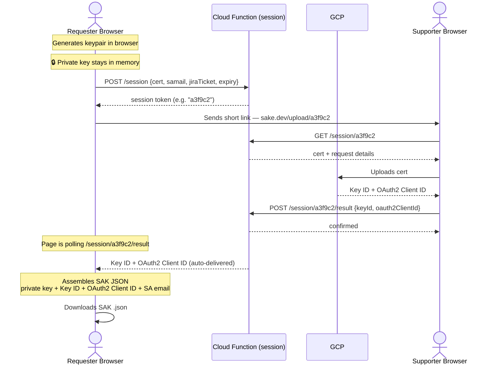

# SAKE — UI Wireframes (Server-Side Handoff)

Optimized flow using a Cloud Function session to eliminate the manual copy-paste step between requester and supporter. The supporter's result is automatically delivered to the requester's page.

---

## How the optimized flow works



**What changed vs the original flow:**
- Certificate travels to the CF, not in the URL — supporter gets a short token link
- No manual copy-paste between supporter and requester
- Requester page polls automatically — values appear without user action
- Both parties can work at their own pace (async)

---

## Landing Page

```
┌─────────────────────────────────────────────────────────────────┐
│                                                                 │
│                    🔑  SAKE                                     │
│          Service Account Key Rotation Helper                    │
│                                                                 │
│  This is a two-person process:                                  │
│                                                                 │
│  You (Requester)              Supporter (GCP access required)   │
│  ─────────────────            ────────────────────────────────  │
│  1. Fill in details           3. Open your link                 │
│  2. Share a short link    →   4. Activate cert in GCP           │
│  5. Download your SAK     ←   (values sent automatically)       │
│                                                                 │
│  ⚠️  Do not close your browser tab once you start.             │
│     Your private key only lives in memory.                      │
│                                                                 │
│  ┌──────────────────────────┐  ┌──────────────────────────┐    │
│  │                          │  │                          │    │
│  │   I need a               │  │   I received a link      │    │
│  │   Service Account Key    │  │   from a requester       │    │
│  │                          │  │                          │    │
│  │      [ Request → ]       │  │   (GCP access required)  │    │
│  │                          │  │   [ Open Upload → ]      │    │
│  │                          │  │                          │    │
│  └──────────────────────────┘  └──────────────────────────┘    │
│                                                                 │
└─────────────────────────────────────────────────────────────────┘
```

---

## Requester — Step 1 / 4: Enter Details

```
┌─────────────────────────────────────────────────────────────────┐
│  ← Back              Request a Service Account Key              │
│  ─────────────────────────────────────────────────────────────  │
│  ① Details  ──  ② Share Link  ──  ③ Waiting  ──  ④ Done        │
│  ─────────────────────────────────────────────────────────────  │
│                                                                 │
│  Jira Ticket *                                                  │
│  ┌─────────────────────────────────────────────────────────┐   │
│  │ e.g. GCP-1234                                           │   │
│  └─────────────────────────────────────────────────────────┘   │
│                                                                 │
│  SA Mail *                                                      │
│  ┌─────────────────────────────────────────────────────────┐   │
│  │ name@project.iam.gserviceaccount.com                    │   │
│  └─────────────────────────────────────────────────────────┘   │
│  ✓  Project: bpde-dev-sandbox   Name: my-service-account        │
│     (parsed automatically from SA Mail)                         │
│                                                                 │
│  Key Expiry (days) *                                            │
│  ┌──────────┐                                                   │
│  │  90      │                                                   │
│  └──────────┘                                                   │
│                                                                 │
│  [ Generate Certificate & Create Session → ]                    │
│  Your browser generates a key pair. The certificate is          │
│  stored on the server — your private key never leaves           │
│  this tab.                                                      │
│                                                                 │
└─────────────────────────────────────────────────────────────────┘
```

---

## Requester — Step 2 / 4: Share Short Link

```
┌─────────────────────────────────────────────────────────────────┐
│  ← Back              Request a Service Account Key              │
│  ─────────────────────────────────────────────────────────────  │
│  ✓ Details  ──  ② Share Link  ──  ③ Waiting  ──  ④ Done        │
│  ─────────────────────────────────────────────────────────────  │
│                                                                 │
│  ┌─────────────────────────────────────────────────────────┐   │
│  │  ⚠️  Do not close this tab!                             │   │
│  │  Your private key only exists here in memory.           │   │
│  │  Closing = losing the key = starting over.              │   │
│  └─────────────────────────────────────────────────────────┘   │
│                                                                 │
│  ✓  Certificate generated & uploaded to session                 │
│     Valid: 22.05.2026 → 19.08.2026 (90 days)                   │
│     Session expires in: 2 hours                                 │
│                                                                 │
│  Send this link to your supporter:                              │
│  ┌─────────────────────────────────────────────────────────┐   │
│  │  https://sake.dev/upload/a3f9c2                         │   │
│  └─────────────────────────────────────────────────────────┘   │
│  [ 📋 Copy Link ]                                               │
│                                                                 │
│  Once they open the link and activate your cert in GCP,         │
│  this page will automatically continue to the next step.        │
│  You don't need to enter anything manually.                     │
│                                                                 │
│  [ I've sent the link → ]                                       │
│                                                                 │
└─────────────────────────────────────────────────────────────────┘
```

---

## Requester — Step 3 / 4: Waiting for Supporter

```
┌─────────────────────────────────────────────────────────────────┐
│  ← Back              Request a Service Account Key              │
│  ─────────────────────────────────────────────────────────────  │
│  ✓ Details  ──  ✓ Share Link  ──  ③ Waiting  ──  ④ Done        │
│  ─────────────────────────────────────────────────────────────  │
│                                                                 │
│  ┌─────────────────────────────────────────────────────────┐   │
│  │  ⚠️  Do not close this tab!                             │   │
│  └─────────────────────────────────────────────────────────┘   │
│                                                                 │
│  ⏳  Waiting for your supporter to activate the certificate…   │
│     Checking automatically every 5 seconds.                     │
│     Session expires in: 1h 52m                                  │
│                                                                 │
│  ────────────────────────────────────────────────────────────  │
│                                                                 │
│  [when supporter completes — page auto-advances to step 4]      │
│                                                                 │
│  ────────────────────────────────────────────────────────────  │
│                                                                 │
│  Supporter hasn't received the link yet?                        │
│  ┌─────────────────────────────────────────────────────────┐   │
│  │  https://sake.dev/upload/a3f9c2                         │   │
│  └─────────────────────────────────────────────────────────┘   │
│  [ 📋 Copy Link Again ]                                         │
│                                                                 │
└─────────────────────────────────────────────────────────────────┘
```

---

## Requester — Step 4 / 4: Download SAK

```
┌─────────────────────────────────────────────────────────────────┐
│  ← Back              Request a Service Account Key              │
│  ─────────────────────────────────────────────────────────────  │
│  ✓ Details  ──  ✓ Share Link  ──  ✓ Waiting  ──  ④ Done        │
│  ─────────────────────────────────────────────────────────────  │
│                                                                 │
│  ✅  Your supporter has activated your certificate.             │
│     Key assembled from:                                         │
│     private key (memory) + Key ID + OAuth2 Client ID (session)  │
│                                                                 │
│  [ ↓ Download Service Account Key (.json) ]                     │
│                                                                 │
│  You can now close this tab safely.                             │
│                                                                 │
│  ────────────────────────────────────────────────────────────  │
│                                                                 │
│  SA Mail:    dummy@project.iam.gserviceaccount.com              │
│  Key ID:     abc123...                                          │
│  Valid from: 22.05.2026                                         │
│  Valid to:   19.08.2026                                         │
│                                                                 │
│  ┌─────────────────────────────────────────────────────────┐   │
│  │  ⚠️  Keep this file secure.                             │   │
│  │  It grants access to your service account.              │   │
│  │  Document Key ID abc123 in Jira ticket GCP-1234.        │   │
│  └─────────────────────────────────────────────────────────┘   │
│                                                                 │
└─────────────────────────────────────────────────────────────────┘
```

---

## Supporter — Step 1 / 3: Review Request

```
┌─────────────────────────────────────────────────────────────────┐
│                    Activate Certificate for Requester            │
│  ─────────────────────────────────────────────────────────────  │
│              ① Review  ──  ② Activate  ──  ③ Done               │
│  ─────────────────────────────────────────────────────────────  │
│                                                                 │
│  Request loaded from session a3f9c2:                            │
│  ┌─────────────────────────────────────────────────────────┐   │
│  │  SA Mail:      dummy@project.iam.gserviceaccount.com    │   │
│  │  Project:      bpde-dev-sandbox                         │   │
│  │  Jira Ticket:  GCP-1234                                 │   │
│  │  Expiry:       90 days  (22.05.2026 → 19.08.2026)       │   │
│  │  Session:      expires in 1h 47m                        │   │
│  └─────────────────────────────────────────────────────────┘   │
│                                                                 │
│  You need to upload this certificate to GCP.                    │
│  Choose how:                                                    │
│                                                                 │
│  [ G  Login with Google ]  — page handles everything            │
│                                                                 │
│  — or —                                                         │
│                                                                 │
│  [ I'll use the CLI instead → ]                                 │
│                                                                 │
└─────────────────────────────────────────────────────────────────┘
```

---

## Supporter — Step 2a / 3: Activate via Browser

```
┌─────────────────────────────────────────────────────────────────┐
│                    Activate Certificate for Requester            │
│  ─────────────────────────────────────────────────────────────  │
│              ✓ Review  ──  ② Activate  ──  ③ Done               │
│  ─────────────────────────────────────────────────────────────  │
│                                                                 │
│  Logged in as: stephan@bonprix.net  ✓                           │
│                                                                 │
│  Existing keys on dummy@project.iam.gserviceaccount.com:        │
│  ┌─────────────────────────────────────────────────────────┐   │
│  │  Key ID       Created       Expires       Status        │   │
│  │  ─────────────────────────────────────────────────────  │   │
│  │  abc123...    01.02.2026    01.05.2026    ⚠️ Expired    │   │
│  │  def456...    01.11.2025    01.02.2026    ⚠️ Expired    │   │
│  └─────────────────────────────────────────────────────────┘   │
│  [ 🗑 Delete abc123 ]   [ 🗑 Delete def456 ]                   │
│                                                                 │
│  ────────────────────────────────────────────────────────────  │
│                                                                 │
│  [ ✓ Upload & Activate Certificate ]                            │
│  GCP registers the cert → Key ID + OAuth2 Client ID are         │
│  automatically sent back to the requester's waiting page.       │
│                                                                 │
└─────────────────────────────────────────────────────────────────┘
```

---

## Supporter — Step 2b / 3: Activate via CLI

```
┌─────────────────────────────────────────────────────────────────┐
│                    Activate Certificate for Requester            │
│  ─────────────────────────────────────────────────────────────  │
│              ✓ Review  ──  ② Activate (CLI)  ──  ③ Done         │
│  ─────────────────────────────────────────────────────────────  │
│                                                                 │
│  Run this command in your terminal:                             │
│                                                                 │
│  ┌─────────────────────────────────────────────────────────┐   │
│  │  TMPF=$(mktemp) && \                                    │   │
│  │  echo -e "-----BEGIN CERTIFICATE-----\n..." > $TMPF && │   │
│  │  gcloud --project bpde-dev-sandbox \                    │   │
│  │    iam service-accounts keys upload $TMPF \             │   │
│  │    --iam-account=dummy@project... --format json \       │   │
│  │    | jq -r '"key id: "+(.name|split("/"))[-1]' && \    │   │
│  │  rm $TMPF && \                                          │   │
│  │  gcloud --project bpde-dev-sandbox \                    │   │
│  │    iam service-accounts describe dummy@project... \     │   │
│  │    --format json \                                      │   │
│  │    | jq -r '"oauth2clientId: "+.oauth2ClientId'         │   │
│  └─────────────────────────────────────────────────────────┘   │
│  [ 📋 Copy Command ]                                            │
│                                                                 │
│  Paste the full output here:                                    │
│  ┌─────────────────────────────────────────────────────────┐   │
│  │  key id: ...                                            │   │
│  │  oauth2clientId: ...                                    │   │
│  └─────────────────────────────────────────────────────────┘   │
│                                                                 │
│  [ ✓ Submit → ]                                                 │
│  Values are sent to the session — requester is notified         │
│  automatically.                                                 │
│                                                                 │
└─────────────────────────────────────────────────────────────────┘
```

---

## Supporter — Step 3 / 3: Done

```
┌─────────────────────────────────────────────────────────────────┐
│                    Activate Certificate for Requester            │
│  ─────────────────────────────────────────────────────────────  │
│              ✓ Review  ──  ✓ Activate  ──  ③ Done               │
│  ─────────────────────────────────────────────────────────────  │
│                                                                 │
│  ✅  Certificate activated. Values sent to requester.           │
│     They will be notified automatically.                        │
│                                                                 │
│  ────────────────────────────────────────────────────────────  │
│                                                                 │
│  [ 💬 Add comment to Jira ticket GCP-1234 ]                    │
│  Posts Key ID + validity dates to the ticket.                   │
│                                                                 │
│  You can close this tab.                                        │
│                                                                 │
└─────────────────────────────────────────────────────────────────┘
```

---

## What the new Cloud Function session endpoint needs

| Endpoint | Method | Description |
|---|---|---|
| `/session` | POST | Creates session. Stores cert + metadata. Returns short token. |
| `/session/{token}` | GET | Returns cert + request details. Used by supporter. |
| `/session/{token}/result` | POST | Stores Key ID + OAuth2 Client ID. Called after supporter activates. |
| `/session/{token}/result` | GET | Returns result if available. Polled by requester every 5s. |

Sessions expire after 2 hours. No sensitive data persists — once the requester downloads the SAK, the session can be deleted.

## Route & Implementation Notes

| Screen | Route | Notes |
|---|---|---|
| Landing | `/` | — |
| Requester steps 1–4 | `/request/` | Single route, `step` state variable in memory |
| Supporter steps 1–3 | `/upload/[token]` | Token from URL, session loaded on mount |

## Changes vs original wireframes

| Change | Reason |
|---|---|
| Long cert URL → short session token URL | Cert stored server-side, URL is just a 6-char token |
| Manual entry of Key ID + OAuth2 Client ID → auto-delivered | Supporter posts to session CF, requester polls |
| Step 3 requester is now a waiting/polling screen | No user input needed — values arrive automatically |
| Supporter step 3 simplified | No need to copy values manually — just confirm Jira comment |
| Session expiry shown | Requester and supporter know how long they have |
