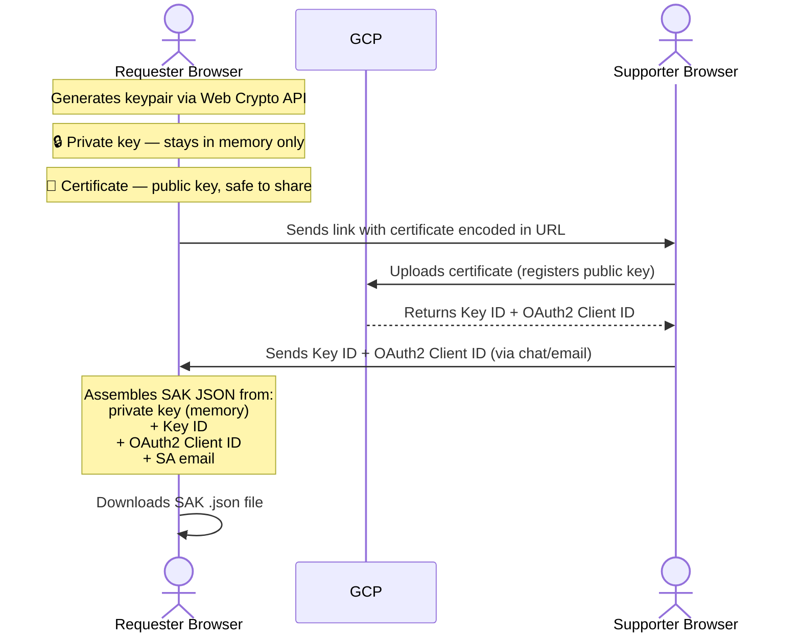

# SAKE — UI Wireframes

Redesigned frontend using a step wizard pattern. All requester steps live in one route (`/request/`) and all supporter steps in one route (`/upload/`) — navigating away would destroy the private key held in browser memory.

---

## How the crypto actually works (for reference)



The private key never leaves the browser. Closing the tab destroys it.

---

## Landing Page

```
┌─────────────────────────────────────────────────────────────────┐
│                                                                 │
│                    🔑  SAKE                                     │
│          Service Account Key Rotation Helper                    │
│                                                                 │
│  This is a two-person process:                                  │
│                                                                 │
│  You (Requester)              Supporter (GCP access required)   │
│  ─────────────────            ────────────────────────────────  │
│  1. Fill in details           3. Open your link                 │
│  2. Generate & share link  →  4. Upload cert to GCP             │
│  5. Enter Key ID back      ←  5. Send Key ID + Client ID back   │
│  6. Download your SAK                                           │
│                                                                 │
│  ⚠️  Do not close your browser tab once you start.             │
│     Your private key only lives in memory.                      │
│                                                                 │
│  ┌──────────────────────────┐  ┌──────────────────────────┐    │
│  │                          │  │                          │    │
│  │   I need a              │  │   I received a link       │    │
│  │   Service Account Key   │  │   from a requester        │    │
│  │                          │  │                          │    │
│  │      [ Request → ]       │  │   (GCP access required)  │    │
│  │                          │  │   [ Open Upload → ]      │    │
│  │                          │  │                          │    │
│  └──────────────────────────┘  └──────────────────────────┘    │
│                                                                 │
└─────────────────────────────────────────────────────────────────┘
```

---

## Requester — Step 1 / 4: Enter Details

```
┌─────────────────────────────────────────────────────────────────┐
│  ← Back              Request a Service Account Key              │
│  ─────────────────────────────────────────────────────────────  │
│  ① Details  ──  ② Share Link  ──  ③ Enter Key ID  ──  ④ Done   │
│  ─────────────────────────────────────────────────────────────  │
│                                                                 │
│  Jira Ticket *                                                  │
│  ┌─────────────────────────────────────────────────────────┐   │
│  │ e.g. GCP-1234                                           │   │
│  └─────────────────────────────────────────────────────────┘   │
│                                                                 │
│  SA Mail *                                                      │
│  ┌─────────────────────────────────────────────────────────┐   │
│  │ name@project.iam.gserviceaccount.com                    │   │
│  └─────────────────────────────────────────────────────────┘   │
│  ✓  Project: bpde-dev-sandbox   Name: my-service-account        │
│     (parsed automatically from SA Mail)                         │
│                                                                 │
│  Key Expiry (days) *                                            │
│  ┌──────────┐                                                   │
│  │  90      │                                                   │
│  └──────────┘                                                   │
│                                                                 │
│  [ Generate Certificate → ]                                     │
│  Clicking this generates a key pair in your browser.            │
│  The private key never leaves this tab.                         │
│                                                                 │
└─────────────────────────────────────────────────────────────────┘
```

---

## Requester — Step 2 / 4: Share Link with Supporter

```
┌─────────────────────────────────────────────────────────────────┐
│  ← Back              Request a Service Account Key              │
│  ─────────────────────────────────────────────────────────────  │
│  ✓ Details  ──  ② Share Link  ──  ③ Enter Key ID  ──  ④ Done   │
│  ─────────────────────────────────────────────────────────────  │
│                                                                 │
│  ┌─────────────────────────────────────────────────────────┐   │
│  │  ⚠️  Do not close this tab!                             │   │
│  │  Your private key only exists here in memory.           │   │
│  │  Closing = losing the key = starting over.              │   │
│  └─────────────────────────────────────────────────────────┘   │
│                                                                 │
│  ✓  Certificate generated                                       │
│     Valid: 22.05.2026 → 19.08.2026 (90 days)                   │
│     The certificate contains your public key + request info.    │
│                                                                 │
│  Send this link to your supporter:                              │
│  ┌─────────────────────────────────────────────────────────┐   │
│  │  https://sake.dev.../upload#cert=...                    │   │
│  └─────────────────────────────────────────────────────────┘   │
│  [ 📋 Copy Link ]                                               │
│  The link contains your certificate — the supporter needs       │
│  nothing else.                                                  │
│                                                                 │
│  Need a fallback? → [ ↓ Download certificate as file ]         │
│  (only if the link doesn't work for the supporter)              │
│                                                                 │
│  Once sent, the supporter will register your cert with GCP      │
│  and send you back two values: Key ID + OAuth2 Client ID.       │
│                                                                 │
│  [ I've sent the link, waiting for response → ]                 │
│                                                                 │
└─────────────────────────────────────────────────────────────────┘
```

---

## Requester — Step 3 / 4: Enter Values from Supporter

```
┌─────────────────────────────────────────────────────────────────┐
│  ← Back              Request a Service Account Key              │
│  ─────────────────────────────────────────────────────────────  │
│  ✓ Details  ──  ✓ Share Link  ──  ③ Enter Key ID  ──  ④ Done   │
│  ─────────────────────────────────────────────────────────────  │
│                                                                 │
│  ┌─────────────────────────────────────────────────────────┐   │
│  │  ⚠️  Do not close this tab!                             │   │
│  └─────────────────────────────────────────────────────────┘   │
│                                                                 │
│  Your supporter has activated your certificate in GCP.          │
│  Enter the two values they sent you:                            │
│                                                                 │
│  Key ID *                                                       │
│  ┌─────────────────────────────────────────────────────────┐   │
│  │                                                         │   │
│  └─────────────────────────────────────────────────────────┘   │
│                                                                 │
│  OAuth2 Client ID *                                             │
│  ┌─────────────────────────────────────────────────────────┐   │
│  │                                                         │   │
│  └─────────────────────────────────────────────────────────┘   │
│                                                                 │
│  [ 🔧 Assemble my Service Account Key → ]                       │
│  Your browser will combine these values with the private key    │
│  in memory to build the final credential file. Nothing is       │
│  sent to any server.                                            │
│                                                                 │
└─────────────────────────────────────────────────────────────────┘
```

---

## Requester — Step 4 / 4: Download SAK

```
┌─────────────────────────────────────────────────────────────────┐
│  ← Back              Request a Service Account Key              │
│  ─────────────────────────────────────────────────────────────  │
│  ✓ Details  ──  ✓ Share Link  ──  ✓ Enter Key ID  ──  ④ Done   │
│  ─────────────────────────────────────────────────────────────  │
│                                                                 │
│                       ✅  Key assembled                         │
│                                                                 │
│  [ ↓ Download Service Account Key (.json) ]                     │
│                                                                 │
│  You can now close this tab safely.                             │
│                                                                 │
│  ────────────────────────────────────────────────────────────  │
│                                                                 │
│  What you downloaded:                                           │
│  A JSON credential file containing your private key + the       │
│  Key ID registered with GCP. Your application uses this file    │
│  to authenticate with Google Cloud.                             │
│                                                                 │
│  SA Mail:    dummy@project.iam.gserviceaccount.com              │
│  Key ID:     abc123...                                          │
│  Valid from: 22.05.2026                                         │
│  Valid to:   19.08.2026                                         │
│                                                                 │
│  ┌─────────────────────────────────────────────────────────┐   │
│  │  ⚠️  Keep this file secure.                             │   │
│  │  It grants access to your service account.              │   │
│  │  Document Key ID abc123 in Jira ticket GCP-1234.        │   │
│  └─────────────────────────────────────────────────────────┘   │
│                                                                 │
└─────────────────────────────────────────────────────────────────┘
```

---

## Supporter — Step 1 / 3: Review Request

```
┌─────────────────────────────────────────────────────────────────┐
│                    Activate Certificate for Requester            │
│  ─────────────────────────────────────────────────────────────  │
│              ① Review  ──  ② Activate  ──  ③ Hand Back          │
│  ─────────────────────────────────────────────────────────────  │
│                                                                 │
│  Request from the link:                                         │
│  ┌─────────────────────────────────────────────────────────┐   │
│  │  SA Mail:      dummy@project.iam.gserviceaccount.com    │   │
│  │  Project:      bpde-dev-sandbox                         │   │
│  │  Jira Ticket:  GCP-1234                                 │   │
│  │  Expiry:       90 days  (22.05.2026 → 19.08.2026)       │   │
│  └─────────────────────────────────────────────────────────┘   │
│  (all of this was embedded in the certificate from the link)    │
│                                                                 │
│  You need to upload this certificate to GCP.                    │
│  Choose how:                                                    │
│                                                                 │
│  [ G  Login with Google ]  — page handles everything for you   │
│                                                                 │
│  — or —                                                         │
│                                                                 │
│  [ I'll use the CLI instead → ]  — get copy-ready commands     │
│                                                                 │
└─────────────────────────────────────────────────────────────────┘
```

---

## Supporter — Step 2a / 3: Activate via Browser

```
┌─────────────────────────────────────────────────────────────────┐
│                    Activate Certificate for Requester            │
│  ─────────────────────────────────────────────────────────────  │
│              ✓ Review  ──  ② Activate  ──  ③ Hand Back          │
│  ─────────────────────────────────────────────────────────────  │
│                                                                 │
│  Logged in as: stephan@bonprix.net  ✓                           │
│                                                                 │
│  Existing keys on dummy@project.iam.gserviceaccount.com:        │
│  ┌─────────────────────────────────────────────────────────┐   │
│  │  Key ID       Created       Expires       Status        │   │
│  │  ─────────────────────────────────────────────────────  │   │
│  │  abc123...    01.02.2026    01.05.2026    ⚠️ Expired    │   │
│  │  def456...    01.11.2025    01.02.2026    ⚠️ Expired    │   │
│  └─────────────────────────────────────────────────────────┘   │
│                                                                 │
│  Delete expired keys before uploading the new one:             │
│  [ 🗑 Delete abc123 ]   [ 🗑 Delete def456 ]                   │
│                                                                 │
│  ────────────────────────────────────────────────────────────  │
│                                                                 │
│  [ ✓ Upload & Activate Certificate ]                            │
│  GCP will register the requester's public key and return        │
│  a Key ID + OAuth2 Client ID.                                   │
│                                                                 │
└─────────────────────────────────────────────────────────────────┘
```

---

## Supporter — Step 2b / 3: Activate via CLI

```
┌─────────────────────────────────────────────────────────────────┐
│                    Activate Certificate for Requester            │
│  ─────────────────────────────────────────────────────────────  │
│              ✓ Review  ──  ② Activate (CLI)  ──  ③ Hand Back    │
│  ─────────────────────────────────────────────────────────────  │
│                                                                 │
│  Run this command in your terminal:                             │
│  (it uploads the cert and prints Key ID + OAuth2 Client ID)     │
│                                                                 │
│  ┌─────────────────────────────────────────────────────────┐   │
│  │  TMPF=$(mktemp) && \                                    │   │
│  │  echo -e "-----BEGIN CERTIFICATE-----\n..." > $TMPF && │   │
│  │  gcloud --project bpde-dev-sandbox \                    │   │
│  │    iam service-accounts keys upload $TMPF \             │   │
│  │    --iam-account=dummy@project... --format json \       │   │
│  │    | jq -r '"key id: " + (.name|split("/"))[-1]' && \  │   │
│  │  rm $TMPF && \                                          │   │
│  │  gcloud --project bpde-dev-sandbox \                    │   │
│  │    iam service-accounts describe dummy@project... \     │   │
│  │    --format json \                                      │   │
│  │    | jq -r '"oauth2clientId: " + .oauth2ClientId'       │   │
│  └─────────────────────────────────────────────────────────┘   │
│  [ 📋 Copy Command ]                                            │
│                                                                 │
│  Paste the full output here:                                    │
│  ┌─────────────────────────────────────────────────────────┐   │
│  │  key id: ...                                            │   │
│  │  oauth2clientId: ...                                    │   │
│  └─────────────────────────────────────────────────────────┘   │
│  [ Parse output → ]                                             │
│                                                                 │
└─────────────────────────────────────────────────────────────────┘
```

---

## Supporter — Step 3 / 3: Hand Back to Requester

```
┌─────────────────────────────────────────────────────────────────┐
│                    Activate Certificate for Requester            │
│  ─────────────────────────────────────────────────────────────  │
│              ✓ Review  ──  ✓ Activate  ──  ③ Hand Back          │
│  ─────────────────────────────────────────────────────────────  │
│                                                                 │
│  ✅  Certificate activated on GCP                               │
│                                                                 │
│  Send these two values back to the requester (via chat):        │
│                                                                 │
│  Key ID                                                         │
│  ┌──────────────────────────────────────┐  [ 📋 Copy ]         │
│  │  abc123def456...                     │                       │
│  └──────────────────────────────────────┘                       │
│                                                                 │
│  OAuth2 Client ID                                               │
│  ┌──────────────────────────────────────┐  [ 📋 Copy ]         │
│  │  111111222222...                     │                       │
│  └──────────────────────────────────────┘                       │
│                                                                 │
│  ────────────────────────────────────────────────────────────  │
│                                                                 │
│  [ 💬 Add comment to Jira ticket GCP-1234 ]                    │
│  (posts Key ID + OAuth2 Client ID + validity dates to Jira)     │
│                                                                 │
└─────────────────────────────────────────────────────────────────┘
```

---

## Route & Implementation Notes

| Screen | Route | Notes |
|---|---|---|
| Landing | `/` | — |
| Requester steps 1–4 | `/request/` | Single route, `step` state variable in memory |
| Supporter steps 1–3 | `/upload/` | Single route, `step` state variable in memory |

**Why single routes:** The private key (CryptoKey object from Web Crypto API) lives in component memory. Route navigation destroys component state → key is lost → requester must start over. All steps must render within the same component.

## What changed vs previous version

| Change | Reason |
|---|---|
| "Decrypt" → "Assemble" | No decryption happens — browser combines private key + Key ID + OAuth2 Client ID into JSON |
| Separate routes per step → single route | Private key lives in memory, destroyed on navigation |
| Two separate CLI commands → one combined command | Actual code generates one command returning both Key ID + OAuth2 Client ID |
| Method selector in step 1 → two buttons | Browser path = Google Login, CLI path = separate flow; clearer as two entry points |
| Added "What you downloaded" explanation | Users need to understand what the JSON file is and how to use it |
| Added "can close tab" note on step 4 | Removes anxiety — users don't know when it's safe to close |
| CLI screen accepts full pasted output | Supporter can paste entire CLI output; app parses it rather than requiring separate manual inputs |
