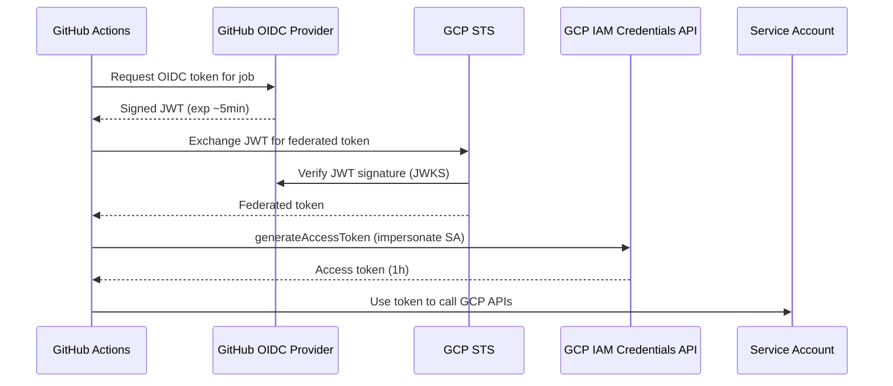

# Workload Identity Federation

[GCP Docs — Workload Identity Federation](https://cloud.google.com/iam/docs/workload-identity-federation) | [GitHub Actions + GCP](https://cloud.google.com/blog/products/identity-security/enabling-keyless-authentication-from-github-actions)

Workload Identity Federation lets external workloads (GitHub Actions, GitLab CI, AWS, on-prem services) authenticate to GCP **without a static service account key**. The external system presents a short-lived token issued by its own identity provider; GCP validates it and exchanges it for a temporary access token.

> **Relevance:** Used in the `wip-gcp-project-key-rotation` / SAKE project so GitHub Actions can run Terraform against GCP without storing any JSON keys in GitHub Secrets.

---

## Why it replaces static keys

A traditional GCP service account key is a long-lived JSON file with a private key. It can be leaked, forgotten in repos, or never rotated. Workload Identity Federation issues tokens that:
- expire after **1 hour** (not months or years)
- are **bound to a specific workflow run** (via JWT claims)
- require **zero secret storage** in the external system

---

## How the token exchange works

```
GitHub Actions workflow starts
  │
  ▼
GitHub OIDC provider issues a signed JWT for the job
  Claims: { sub, repository, ref, actor, workflow, ... }
  │
  ▼
google-github-actions/auth action sends JWT to GCP
  POST https://sts.googleapis.com/v1/token
  grant_type: urn:ietf:params:oauth2:grant-type:token-exchange
  subject_token: <GitHub JWT>
  │
  ▼
GCP Security Token Service (STS) validates the JWT:
  - Fetches GitHub's JWKS endpoint to verify signature
  - Checks attribute conditions (repo, branch, etc.)
  │
  ▼
STS returns a short-lived federated token
  │
  ▼
(Optional) Impersonate a service account:
  POST https://iamcredentials.googleapis.com/v1/projects/-/serviceAccounts/{SA}:generateAccessToken
  Returns: access_token valid for 1 hour
```



---

## Workload Identity Pool & Provider

A **Pool** is a container that groups external identities. A **Provider** within the pool defines which OIDC issuer is trusted and how JWT claims map to GCP attributes.

```hcl
# Terraform example — already deployed in SAKE project
resource "google_iam_workload_identity_pool" "github" {
  workload_identity_pool_id = "github-oidc-pool"
}

resource "google_iam_workload_identity_pool_provider" "github" {
  workload_identity_pool_id          = google_iam_workload_identity_pool.github.workload_identity_pool_id
  workload_identity_pool_provider_id = "github-oidc-provider"

  oidc {
    issuer_uri = "https://token.actions.githubusercontent.com"
  }

  attribute_mapping = {
    "google.subject"       = "assertion.sub"
    "attribute.repository" = "assertion.repository"
    "attribute.ref"        = "assertion.ref"
  }

  # Only allow tokens from this specific repo on main branch
  attribute_condition = "attribute.repository == 'bonprix/wip-gcp-project-key-rotation' && attribute.ref == 'refs/heads/main'"
}
```

---

## IAM binding — granting pool identities access to a SA

```hcl
resource "google_service_account_iam_member" "github_wif" {
  service_account_id = google_service_account.iac.name
  role               = "roles/iam.workloadIdentityUser"
  # principal format: principalSet://iam.googleapis.com/projects/{PROJECT_NUM}/locations/global/workloadIdentityPools/{POOL}/attribute.repository/{REPO}
  member = "principalSet://iam.googleapis.com/projects/${var.project_num}/locations/global/workloadIdentityPools/github-oidc-pool/attribute.repository/bonprix/wip-gcp-project-key-rotation"
}
```

---

## GitHub Actions usage

```yaml
jobs:
  deploy:
    permissions:
      id-token: write   # required — allows the job to request an OIDC token
      contents: read

    steps:
      - uses: google-github-actions/auth@v2
        with:
          workload_identity_provider: projects/328161350925/locations/global/workloadIdentityPools/github-oidc-pool/providers/github-oidc-provider
          service_account: infrastructureascode@bpde-dev-key-rotation.iam.gserviceaccount.com

      - run: gcloud projects list  # authenticated via the generated access token
```

The `id-token: write` permission is mandatory — without it GitHub will not issue an OIDC token for the job.

---

## Two-SA pattern (owner vs. viewer)

The SAKE project uses two service accounts with different permission scopes:

| SA | Permissions | Allowed ref |
|---|---|---|
| `infrastructureascode` | Project Owner | `refs/heads/main` only |
| `infrastructureascode-viewer` | Read-only (viewer) | All refs (PRs, branches) |

PRs trigger Terraform **plan** (viewer), merges to main trigger Terraform **apply** (owner). The attribute condition in the WIF provider enforces this split — no code change can escalate a PR to Owner permissions.

---

## Summary

| Concept | Detail |
|---|---|
| Token lifetime | 1 hour (access token), ~5 min (GitHub JWT) |
| No secret stored in | GitHub Secrets, environment, disk |
| Validated by | GCP STS via GitHub JWKS endpoint |
| Restriction mechanism | `attribute_condition` on pool provider |
| Impersonation role needed | `roles/iam.workloadIdentityUser` on the SA |

---

## Related Topics

- [[IAM]] — IAM roles needed to allow WIF impersonation
- [[Service Account Key Rotation]] — SAKE project that uses WIF for GitHub Actions CI/CD
- [[GoogleCloud]] — GCP platform overview
- [[Public Cloud]] — cloud service models and providers
