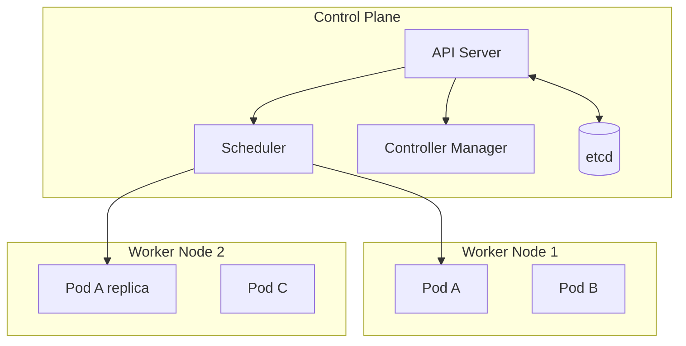

# Kubernetes

[Official Documentation](https://kubernetes.io/docs/home/) | [Kubernetes Concepts](https://kubernetes.io/docs/concepts/)

Kubernetes (K8s) is an open-source container orchestration platform that automates deployment, scaling, and management of containerised applications across clusters of machines.

---

## The problem it solves

[[docker|Docker]] alone runs containers on a single machine. At scale you need to answer:
- Which machine runs which container?
- What happens when a container crashes?
- How do you roll out a new version without downtime?
- How do you scale up under load and back down when idle?

Kubernetes automates all of this across a fleet of machines.

---

## Core concepts

### Cluster
The top-level unit — a set of machines (nodes) managed together by Kubernetes.

```
Cluster
├── Control Plane (manages the cluster)
└── Worker Nodes (run the workloads)
```

### Node
A single machine (physical or virtual) in the cluster. The **control plane** manages the cluster state; **worker nodes** run the actual containers.

### Pod
The smallest deployable unit in Kubernetes — wraps one or more containers that share network and storage. Containers in the same Pod can communicate via `localhost`.

```yaml
apiVersion: v1
kind: Pod
metadata:
  name: kwizz-backend
spec:
  containers:
    - name: ktor-app
      image: kwizz/backend:1.0
      ports:
        - containerPort: 8080
```

### Deployment
Declares the desired state: "run 3 replicas of this container, always." Kubernetes continuously reconciles actual state toward desired state — restarting crashed Pods, scheduling replacements on failed nodes.

```yaml
apiVersion: apps/v1
kind: Deployment
metadata:
  name: kwizz-backend
spec:
  replicas: 3
  selector:
    matchLabels:
      app: kwizz-backend
  template:
    spec:
      containers:
        - name: ktor-app
          image: kwizz/backend:1.0
```

### Service
Gives a stable network address to a set of Pods. Pods are ephemeral and get new IPs when replaced — a Service provides a consistent DNS name and load-balances across the matching Pods.

```yaml
apiVersion: v1
kind: Service
metadata:
  name: kwizz-backend-svc
spec:
  selector:
    app: kwizz-backend
  ports:
    - port: 80
      targetPort: 8080
```

### Ingress
Manages external HTTP/HTTPS access to Services — routing rules by hostname or path, SSL termination.

---

## Key automation behaviours

| Behaviour | What Kubernetes does |
|---|---|
| **Self-healing** | Restarts failed containers, replaces failed nodes |
| **Auto-scaling** | Adds/removes Pod replicas based on CPU/memory (HPA) |
| **Rolling updates** | Deploys new versions gradually, rolls back on failure |
| **Service discovery** | DNS-based discovery between services in the cluster |
| **Secret management** | Stores credentials separately from application config |

---

## Architecture diagram



---

## Kubernetes vs Docker Compose

| | Docker Compose | Kubernetes |
|---|---|---|
| Scale | Single machine | Multiple machines |
| Self-healing | No | Yes |
| Auto-scaling | No | Yes |
| Rolling updates | Manual | Built-in |
| Complexity | Low | High |
| Use case | Local dev, small deployments | Production at scale |

---

## Managed Kubernetes

Every major cloud provider offers managed Kubernetes — they run the control plane, you manage your workloads:

| Provider | Service |
|---|---|
| AWS | EKS (Elastic Kubernetes Service) |
| Google Cloud | GKE (Google Kubernetes Engine) |
| Azure | AKS (Azure Kubernetes Service) |
| Self-hosted | kubeadm, k3s, RKE |

---

## When NOT to use Kubernetes

Kubernetes adds significant operational complexity. For small projects (e.g. a single-service backend), [[docker|Docker]] Compose or a managed container service is simpler and sufficient. K8s pays off when you have multiple services, need high availability, and have the team capacity to manage it.

---

## Related Topics

- [[docker]] — Kubernetes orchestrates Docker containers; understanding Docker is a prerequisite
- [[Cloud Native]] — Kubernetes is the dominant runtime platform for cloud-native applications
- [[Serverless]] — alternative compute model: less control, less operational overhead than K8s
- [[Observability]] — essential for operating a K8s cluster in production
