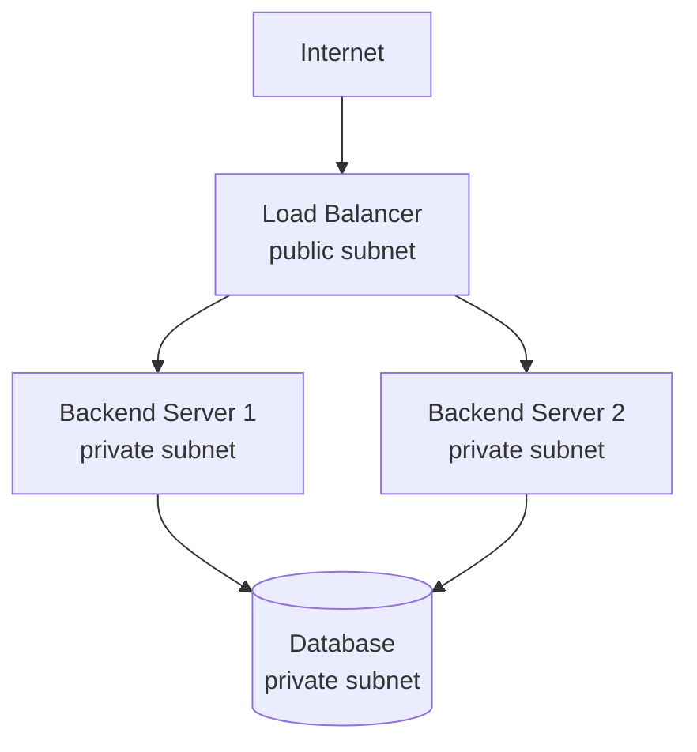

# Load Balancer

[NGINX Load Balancing](https://docs.nginx.com/nginx/admin-guide/load-balancer/http-load-balancer/) | [AWS ELB Docs](https://docs.aws.amazon.com/elasticloadbalancing/)

A load balancer distributes incoming network requests across multiple backend instances so no single server is overwhelmed. It is the standard entry point for any horizontally scaled service.

---

## The Problem

A single server handling all traffic becomes a bottleneck and single point of failure. A load balancer solves both problems simultaneously:

```
                  Requests
                      ↓
             [Load Balancer]
              /      |      \
        Server 1  Server 2  Server 3
```

Clients only ever communicate with the load balancer — they are unaware of how many servers exist behind it.

---

## Core Features

| Feature | Description |
|---|---|
| **Traffic distribution** | Spreads requests across healthy backend instances |
| **Health checks** | Continuously checks each backend; stops sending traffic to unhealthy ones |
| **SSL/TLS termination** | Handles HTTPS so backend servers receive plain HTTP internally |
| **Sticky sessions** | Routes the same client to the same backend (when session state exists) |
| **Connection draining** | Lets in-flight requests complete before removing a backend from rotation |

---

## Load Balancing Algorithms

| Algorithm | How it works | Best for |
|---|---|---|
| **Round Robin** | Requests distributed in order: 1, 2, 3, 1, 2, 3... | Uniform request cost |
| **Least Connections** | Routes to backend with fewest active connections | Variable request duration |
| **IP Hash** | Client IP determines backend — effectively sticky | Session affinity without cookies |
| **Weighted** | Backends get proportional traffic share by weight | Mixed instance sizes |

---

## Layer 4 vs Layer 7

| Layer 4 (Transport) | Layer 7 (Application) |
|---|---|
| Routes based on IP + TCP/UDP port | Routes based on HTTP headers, URL path, host |
| Faster, lower overhead | More flexible routing rules |
| No visibility into HTTP content | Can route `/api/*` to one backend, `/static/*` to another |
| Example: AWS NLB | Example: AWS ALB, NGINX, HAProxy |

Layer 7 load balancers are the standard choice for HTTP services.

---

## Relationship to Other Infrastructure

In a typical secure cloud architecture, the load balancer sits in the **public subnet** while backend servers sit in a **private subnet**:



The database is never exposed to the internet — only the load balancer is.

---

## Load Balancer vs API Gateway

| Load Balancer | API Gateway |
|---|---|
| Distributes traffic across identical instances | Routes to different services by path/rule |
| Networking focus | API management focus |
| No built-in auth or rate limiting | Auth, rate limiting, transformation built in |
| Lower overhead | Higher features |

They are complementary: API Gateway in front for API management, load balancer behind for scaling backend instances.

---

## Related Topics

- [[Cloud Native]] — load balancers are fundamental infrastructure in cloud-native deployments
- [[Kubernetes]] — Kubernetes Services provide internal load balancing; Ingress controllers add external load balancing
- [[API Gateway]] — sits in front of or alongside the load balancer for HTTP API traffic
- [[Observability]] — request rate, error rate, and latency per backend are key load balancer metrics
