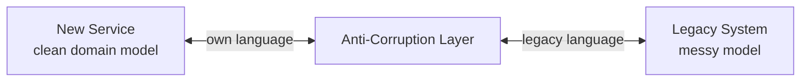
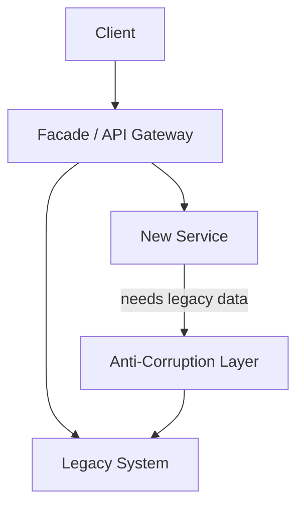

# Anti-Corruption Layer

[Martin Fowler — Anti-Corruption Layer](https://martinfowler.com/eaaCatalog/antiCorruptionLayer.html) | [Microsoft — ACL Pattern](https://learn.microsoft.com/en-us/azure/architecture/patterns/anti-corruption-layer)

An Anti-Corruption Layer (ACL) is a translation layer placed between a new system and a legacy (or external) system. It maps between their data models and terminology, preventing the legacy's design from leaking into and corrupting the new system's domain model.

---

## The problem it solves

When a new service must communicate with a legacy system, the temptation is to adopt the legacy's field names and structures for convenience. Over time the new service ends up looking exactly like the old one — the rewrite has produced no improvement.

```
Legacy: customer.client_ref_no, customer.addr1, acct_status_cd = 1
New service adopts the same names → corrupted by legacy terminology
```

The ACL keeps the boundary clean.

---

## How it works



The new service only ever speaks its own domain language. The ACL translates in both directions. The legacy system is unaware of the new service's model.

---

## Concrete example

Legacy user object:
```kotlin
// Legacy — accumulated 10 years of fields
data class ClientRecord(
    val client_ref_no: String,
    val addr1: String,
    val addr2: String,
    val acct_status_cd: Int,    // 1=active, 2=suspended, 99=deleted
    val legacy_flag_x: Boolean  // nobody knows what this does
)
```

New service domain model:
```kotlin
data class User(
    val id: UserId,
    val address: Address,
    val status: UserStatus  // enum: ACTIVE, SUSPENDED, DELETED
)
```

Anti-Corruption Layer:
```kotlin
class UserAntiCorruptionLayer(private val legacyClient: LegacyApiClient) {

    fun getUser(id: UserId): User {
        val record = legacyClient.getClientRecord(id.value)
        return User(
            id = UserId(record.client_ref_no),
            address = Address(line1 = record.addr1, line2 = record.addr2),
            status = when (record.acct_status_cd) {
                1    -> UserStatus.ACTIVE
                2    -> UserStatus.SUSPENDED
                99   -> UserStatus.DELETED
                else -> throw IllegalStateException("Unknown status: ${record.acct_status_cd}")
            }
        )
    }
}
```

The new service calls `userAcl.getUser(id)` and only ever sees `User` — the legacy model is invisible to it.

---

## Where it lives in the Strangler Fig



The ACL is a **temporary component** — it exists only as long as the new service depends on the legacy. When that dependency is gone, the ACL is deleted.

---

## What it protects against

| Without ACL | With ACL |
|---|---|
| Legacy field names spread into new code | New service uses its own domain language |
| Legacy quirks handled everywhere | Handled in one place |
| Hard to test (depends on legacy shape) | New service testable against clean model |
| Migration hard to complete — too much [[Coupling]] | Clear seam: delete ACL when legacy is gone |
| Refactoring legacy model breaks new code | Only the ACL needs updating |

---

## ACL vs Adapter Pattern

Both translate between interfaces — but the intent differs:

| Adapter | Anti-Corruption Layer |
|---|---|
| Makes two compatible interfaces work together | Protects a domain model from external pollution |
| Short-term compatibility shim | Deliberate boundary with a richer translation |
| No domain model protection | Explicit domain model on one side |

The ACL often contains multiple Adapters internally.

---

## Related Topics

- [[Strangler Fig]] — ACL is the standard companion during a Strangler Fig migration
- [[Integration Architecture]] — ACL is a key integration boundary pattern
- [[Saga Pattern]] — ACLs protect saga steps from legacy data model leakage
- [[Repository]] — both abstract away an external system behind a clean interface; ACL adds domain translation
