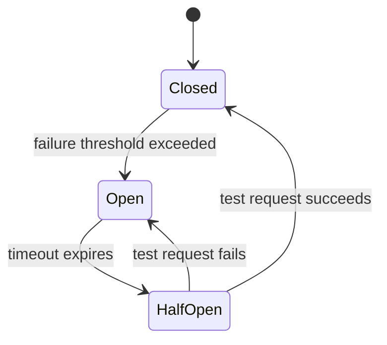

# Circuit Breaker

[Martin Fowler — Circuit Breaker](https://martinfowler.com/bliki/CircuitBreaker.html) | [Resilience4j Docs](https://resilience4j.readme.io/docs/circuitbreaker)

The Circuit Breaker pattern prevents cascading failures in distributed systems by stopping calls to a failing dependency and providing a fallback — instead of letting every request hang until timeout.

---

## The Problem

Without a circuit breaker, a slow or failing [[Upstream and Downstream|downstream]] service causes:
- Every request to that service waits for the full timeout (e.g. 30s)
- Threads pile up waiting
- Your service slows down and eventually crashes
- One failing dependency takes down the entire system — a **cascading failure**

---

## Three States



| State | Behaviour |
|---|---|
| **Closed** | Normal — requests pass through to the dependency |
| **Open** | Failing — requests are immediately rejected, no calls made |
| **Half-Open** | Recovery check — a small number of test requests are allowed through |

---

## How It Works

1. Circuit starts **Closed** — all requests pass through normally
2. Failures accumulate (errors, timeouts) beyond a configured threshold
3. Circuit **Opens** — subsequent requests are rejected instantly without calling the dependency
4. After a configured timeout, circuit moves to **Half-Open**
5. A test request is made:
   - **Succeeds** → circuit **Closes**, normal operation resumes
   - **Fails** → circuit **Opens** again, wait another timeout period

---

## Configuration Parameters

| Parameter | Purpose | Example |
|---|---|---|
| **Failure threshold** | How many failures trigger opening | 5 failures in 10 seconds |
| **Slow call threshold** | Treat slow calls as failures | Calls > 2s count as failures |
| **Open timeout** | How long to stay open before half-open | 30 seconds |
| **Half-open test count** | How many test calls in half-open state | 3 requests |
| **Success threshold** | Successes needed in half-open to close | 2 of 3 succeed |

---

## Protected Execution

A call is only monitored by the circuit breaker if it runs **inside** the circuit breaker's execute block. Unprotected calls bypass the circuit breaker entirely.

```kotlin
// Unprotected — circuit breaker knows nothing about this
val result = rankingService.getRanking(userId)

// Protected — circuit breaker monitors, controls, and can short-circuit
val result = circuitBreaker.executeSupplier {
    rankingService.getRanking(userId)
} 
```

All calls to unreliable dependencies should be wrapped.

---

## Fallback

When the circuit is Open, return a fallback instead of an error:

```kotlin
val result = Try.ofSupplier(
    CircuitBreaker.decorateSupplier(circuitBreaker) {
        rankingService.getRanking(userId)
    }
).recover { Ranking.defaultForUser(userId) }.get()
```

Fallback options:
- Return cached/stale data
- Return a safe default value
- Queue the request for later processing
- Return a degraded response with a user-facing message

---

## Event-Driven Monitoring

Circuit breakers emit events on state transitions — subscribe to feed [[Observability]] pipelines:

```kotlin
circuitBreaker.eventPublisher
    .onStateTransition { event ->
        when (event.stateTransition) {
            CLOSED_TO_OPEN ->
                alerting.notify("Circuit breaker opened: ${event.circuitBreakerName}")
            HALF_OPEN_TO_CLOSED ->
                logger.info("Service recovered: ${event.circuitBreakerName}")
        }
        metrics.record(event)
    }
    .onCallNotPermitted {
        metrics.increment("circuit_breaker.rejected")
    }
```

---

## Resilience Pattern Family

Circuit Breaker is typically combined with:

| Pattern | What it adds |
|---|---|
| **Retry** | Retries failed calls (only when circuit is Closed) |
| **Timeout** | Prevents waiting indefinitely; feeds failure count |
| **Bulkhead** | Limits concurrent calls to isolate failures to one area |
| **Rate Limiter** | Prevents overwhelming a recovering service |

---

## Implementations

| Language / Platform | Library |
|---|---|
| Java / Kotlin | Resilience4j (recommended), Hystrix (deprecated) |
| .NET | Polly |
| Go | gobreaker |
| Infrastructure level | Istio, AWS App Mesh (service mesh) |

---

## Related Topics

- [[Observability]] — circuit breaker state transitions should feed into dashboards and alerts
- [[Saga Pattern]] — sagas use circuit breakers to handle failures in distributed transactions
- [[Messaging Patterns]] — async processing via queues naturally avoids the synchronous blocking that circuit breakers protect against
- [[Repository]] — circuit breakers wrap external calls, similar to how repositories abstract data access
