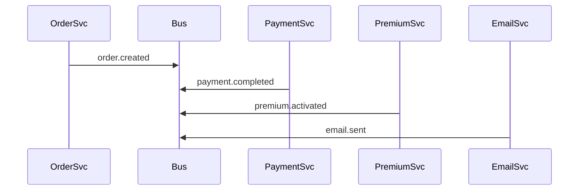
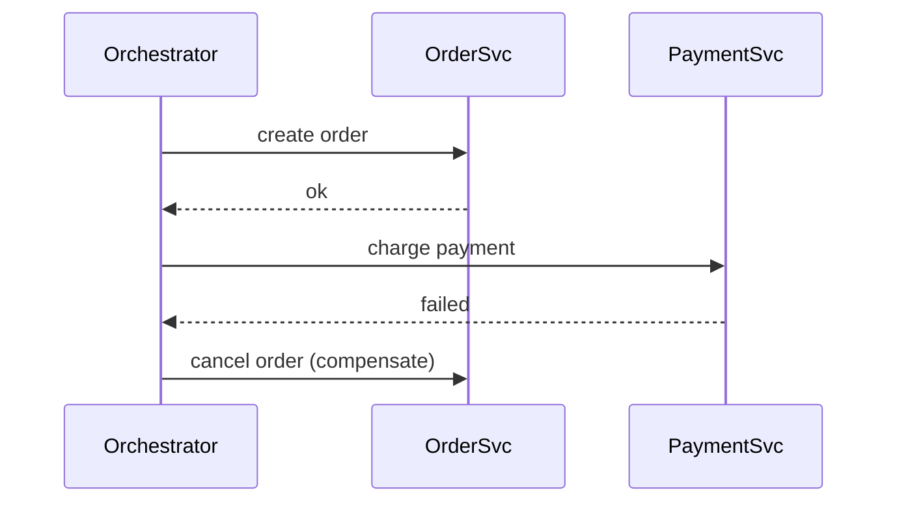

# Saga Pattern

[Microservices.io — Saga Pattern](https://microservices.io/patterns/data/saga.html) | [Chris Richardson — Saga](https://chrisrichardson.net/post/microservices/2019/07/09/developing-sagas-part-1.html)

The Saga pattern manages long-running, multi-step transactions across multiple services where a single distributed database transaction is not possible. It ensures data consistency through a sequence of local transactions, each with a compensating transaction that undoes its effect on failure.

---

## The Problem

In a single database, transactions are atomic:
```sql
BEGIN;
  UPDATE accounts SET balance = balance - 100 WHERE id = 1;
  UPDATE accounts SET balance = balance + 100 WHERE id = 2;
COMMIT; -- both happen, or neither does
```

In a microservices architecture, each service owns its own database. You cannot wrap multiple services in one transaction. If step 2 fails after step 1 succeeds, you need an explicit mechanism to undo step 1.

---

## Structure

A saga is a sequence of steps. Each step has:
- A **local transaction** — the action to perform
- A **compensating transaction** — how to undo it if a later step fails

```
Step 1: Create Order        ← compensate: Cancel Order
Step 2: Charge Payment      ← compensate: Refund Payment
Step 3: Activate Premium    ← compensate: Deactivate Premium
Step 4: Send Confirmation   ← (no compensation needed — notification)
```

On failure at step 3, compensations run in reverse:
```
✗ Step 3 fails
← Compensate Step 2: Refund Payment
← Compensate Step 1: Cancel Order
```

---

## Two Implementation Approaches

### Choreography
Services react to each other's events via a [[Messaging Patterns|topic bus]]. No central coordinator exists.



Each service listens for events it cares about, acts, then publishes its own event.

**Pros:** Loose [[Coupling]], no single point of failure, services are independent
**Cons:** Flow is invisible — spread across multiple services; hard to debug

---

### Orchestration
A central **Saga Orchestrator** explicitly commands each service and handles failures.



**Pros:** Flow is explicit and visible in one place; easy to audit and debug
**Cons:** Orchestrator becomes a critical component; tighter coupling to the coordinator

---

## Choreography vs Orchestration

| | Choreography | Orchestration |
|---|---|---|
| **Flow definition** | Implicit, distributed across services | Explicit, centralised in orchestrator |
| **Coupling** | Services coupled to event schema | Services coupled to orchestrator |
| **Visibility** | Hard to follow | Easy to visualise |
| **Debugging** | Requires tracing events across services | Single execution history |
| **Best for** | Simple, stable flows | Complex flows, many failure modes |
| **AWS tooling** | SNS + SQS | AWS Step Functions |

---

## Topic Bus with Subscription

In choreography, services communicate through a shared **topic bus**:

1. A service publishes an event to a topic
2. Interested services subscribe to that topic
3. Both success and failure events travel via the bus
4. Compensations are triggered by failure event subscriptions

SNS message filtering lets each subscriber receive only relevant events without receiving everything on the bus.

---

## Externalising Workflow

Orchestration **externalises** the workflow — the flow logic lives in the orchestrator, not inside services. Services become stateless executors: they only know how to perform and undo their own action.

Benefits:
- Change the business flow without touching individual services
- Services are reusable across multiple sagas
- Full execution history in one place

---

## Combining Choreography and Orchestration

In practice, both are used together at different levels:

```
Domain boundary → Choreography (topic bus between domains)
Within domain   → Orchestration (Step Functions manages internal saga)
```

Each domain manages its own internal flow with an orchestrator. Domains announce outcomes to the shared bus; other domains subscribe and react independently.

---

## Saga vs ACID Transaction

| ACID Transaction | Saga |
|---|---|
| Atomic — all or nothing | Eventually consistent — brief window of inconsistency |
| Rollback is automatic | Compensating transactions must be explicitly written |
| Works within one database | Works across multiple services/databases |
| Not applicable to microservices | The standard approach for distributed transactions |

---

## Related Topics

- [[Messaging Patterns]] — choreography sagas rely on pub/sub and topic buses
- [[Circuit Breaker]] — protects individual service calls within saga steps
- [[Observability]] — correlation IDs on events allow tracing a saga's full journey
- [[Repository]] — each service's local transaction goes through its own repository
