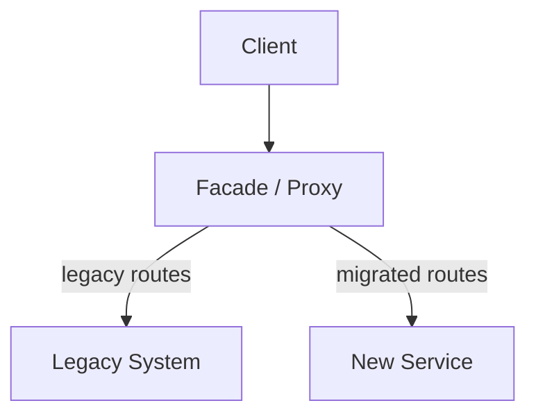

# Strangler Fig Pattern

[Martin Fowler — Strangler Fig Application](https://martinfowler.com/bliki/StranglerFigApplication.html) | [Microsoft — Strangler Fig Pattern](https://learn.microsoft.com/en-us/azure/architecture/patterns/strangler-fig)

The Strangler Fig pattern is a migration strategy for incrementally replacing a legacy system by building a new system around it — routing traffic piece by piece until the legacy can be decommissioned entirely.

> Named after the strangler fig tree, which grows around a host tree and eventually replaces it entirely.

---

## The problem it solves

A full "big bang" rewrite of a large legacy system is extremely risky:
- Takes months or years before anything ships
- High chance of missing behaviour or reintroducing bugs
- If it fails, everything is lost

The Strangler Fig replaces the system **incrementally**, shipping continuously and keeping the system live throughout.

---

## How it works



1. Put a **facade** (API Gateway, proxy, or load balancer) in front of the legacy system — all traffic routes through it
2. Pick one feature or domain, reimplement it in the new system
3. Redirect that feature's traffic to the new service at the facade
4. Repeat for the next feature
5. When all routes are migrated, decommission the legacy

At every step the system is live and functional. The legacy gets smaller with every iteration.

---

## Migration example

Legacy monolith handles `/quiz`, `/users`, `/ranking`, `/notifications`:

```
Step 1: Redirect /notifications → Notification Service  (monolith handles the rest)
Step 2: Redirect /ranking       → Ranking Service
Step 3: Redirect /users         → User Service
Step 4: Redirect /quiz          → Quiz Service
Step 5: Decommission monolith
```

---

## The facade is critical

The facade is what makes this transparent to clients:
- Clients never change URLs or contracts — they always talk to the same address
- The facade decides which backend handles each request
- Traffic can be shifted gradually (e.g. 10% → new, 90% → legacy) for canary testing

In AWS this is typically an [[API Gateway]] or [[Load Balancer]].

---

## Ownership matters

Ownership is as important as the technical implementation:

| What needs an owner | Why |
|---|---|
| The facade | Routing changes must be fast and low-friction |
| Each new service | Accountable for correctness and decommissioning the legacy equivalent |
| The migration roadmap | Decides order, pace, and definition of "done" |
| Data migration per domain | Ensures data ownership transfers cleanly, not just code |

**Most common failure mode:** the new service is built and handles traffic, but nobody decommissions the old code — both systems run forever, doubling maintenance cost.

A feature is only truly migrated when:
1. New service handles all traffic
2. Old code is **deleted**
3. Old data is migrated or deprecated
4. Monitoring confirms the new service is healthy

---

## Strangler Fig vs Big Bang Rewrite

| Strangler Fig | Big Bang Rewrite |
|---|---|
| Incremental — ship every sprint | All-or-nothing — ship when done |
| Always live in production | Not live until fully complete |
| Easy to roll back one feature | Rollback means scrapping everything |
| Lower risk | Very high risk |
| Industry recommended | Strongly discouraged for large systems |

---

## Related Topics

- [[Anti-Corruption Layer]] — protects new services from being shaped by legacy data models during migration
- [[Saga Pattern]] — often needed when migrating transactional flows across services
- [[API Gateway]] — typical facade implementation
- [[Integration Architecture]] — broader discipline governing how legacy and new systems connect
- [[Cloud Native]] — Strangler Fig is the standard path from legacy to cloud-native architecture
