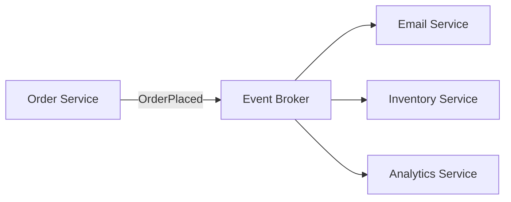

# Event-Driven Architecture

[Martin Fowler — What do you mean by "Event-Driven"?](https://martinfowler.com/articles/201701-event-driven.html) | [AWS — Event-Driven Architecture](https://aws.amazon.com/event-driven-architecture/)

Event-Driven Architecture (EDA) is an architectural style where services communicate by **producing and reacting to events** rather than calling each other directly. It is the primary approach for building loosely coupled, independently scalable distributed systems.

---

## What Is an Event?

An event is a record that something **happened in the past** — a fact, not a request.

```json
{ "type": "OrderPlaced", "orderId": 42, "userId": 7, "total": 29.99, "timestamp": "2026-05-21T10:00:00Z" }
{ "type": "UserSignedUp", "userId": 7, "email": "user@example.com" }
{ "type": "PaymentFailed", "orderId": 42, "reason": "insufficient_funds" }
```

Events are immutable and describe what occurred — they do not tell any service what to do next.

---

## Events vs. Commands

| | Command | Event |
|---|---|---|
| Meaning | "Do this" | "This happened" |
| Direction | Targeted at a specific service | Broadcast to anyone who cares |
| Sender knows receiver | Yes | No |
| Example | `SendConfirmationEmail` | `OrderPlaced` |

Commands are still [[Coupling|coupled]] — you're telling a specific service what to do. Events are not — you announce, others decide whether to react.

---

## How It Works



1. A service (producer) emits an event to an [[Event Broker]]
2. The broker routes the event to all interested consumers
3. Each consumer reacts independently

The Order Service doesn't know who receives the event. New consumers can be added without changing the producer.

---

## vs. Request-Driven Architecture

```
Request-driven:
  Order Service --> calls --> Email Service
  Order Service --> calls --> Inventory Service
  Order Service --> calls --> Analytics Service
  (Order Service must know about all three, all must be available)

Event-driven:
  Order Service --> fires "OrderPlaced" --> done
  (Order Service knows nothing about the others)
```

---

## Key Properties

**Loose [[Coupling]]:** Producer doesn't know consumers — new reactions can be added without modifying the producer.

**Independent scaling:** Each consumer processes events at its own pace from its own queue.

**Resilience:** A consumer going down doesn't affect the producer or other consumers. Events queue up and are processed when the consumer recovers.

**Temporal decoupling:** Producer and consumers don't need to be running at the same time. See [[Messaging Patterns]].

**Auditability:** The event log is a full history of what happened in the system.

---

## Tradeoffs

| Advantage | Disadvantage |
|---|---|
| Loose coupling | Harder to trace end-to-end flows |
| Independent scaling | [[Eventual Consistency]] (not immediate) |
| Resilient to failures | Debugging requires distributed tracing |
| Easy to extend | Event schema changes need careful versioning |

---

## AWS Tools for EDA

| Service | Role |
|---|---|
| [[SNS]] | Pub/sub topic — broadcasts events to multiple subscribers |
| [[SQS]] | Durable queue — buffers events per consumer |
| EventBridge | Event bus with rules-based routing and schema registry |
| [[Lambda]] | Serverless consumer — reacts to events without managing servers |
| Kinesis | High-throughput ordered event streaming |
| MSK (Kafka) | Managed Kafka for large-scale event streaming |

The canonical AWS EDA pattern: **SNS → SQS → Lambda** (fan-out with durable buffering per consumer).

---

## Open/Closed in Practice

Adding a loyalty points service to an existing system:

```
Without EDA: modify Order Service to call Loyalty Service
With EDA:    Loyalty Service subscribes to "OrderPlaced" — Order Service unchanged
```

This is the open/closed principle applied at the infrastructure level.

---

## Related Topics

- [[Messaging Patterns]] — the patterns EDA is built on: pub/sub, fan-out, topic-queue chaining
- [[Event Broker]] — the infrastructure component that routes events between producers and consumers
- [[Coupling]] — EDA primarily reduces temporal, location, and behavioral coupling
- [[Saga Pattern]] — choreography-based sagas are EDA applied to distributed transactions
- [[Cloud Native]] — EDA is a core principle of cloud-native system design
- [[Integration Architecture]] — EDA is one of the four integration styles
