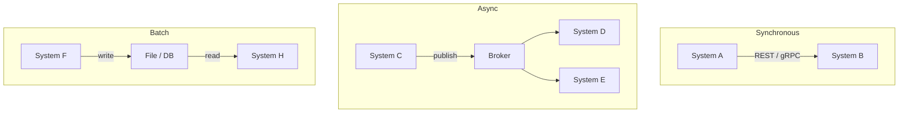

# Integration Architecture

[Enterprise Integration Patterns (Hohpe & Woolf)](https://www.enterpriseintegrationpatterns.com/) | [Martin Fowler — Integration Patterns](https://martinfowler.com/articles/enterprisePatterns.html)

Integration architecture is the discipline of designing how separate systems, services, and applications connect and exchange data reliably, consistently, and maintainably. It answers: how do all these things work together?

---

## Why it exists

Almost no system stands alone. A business typically has a CRM, ERP, payment provider, logistics platform, internal services, and third-party APIs — all of which need to exchange data. Integration architecture governs how they connect.

---

## The Four Integration Styles

### 1. File Transfer
Systems exchange data by writing and reading files (CSV, XML, JSON) via shared storage or SFTP.

```
System A → writes file → shared storage → System B reads file
```

Oldest approach. Simple but slow, no real-time capability, error-prone (partial writes, no acknowledgement). Still common in finance, logistics, and legacy enterprise.

---

### 2. Shared Database
Multiple systems read and write the same database directly.

```
System A ──┐
            ├──→ Shared Database
System B ──┘
```

Simple to implement; terrible in practice. Systems become tightly coupled at the data layer — a schema change in one breaks the other. Violates data ownership. Avoid in new systems.

---

### 3. Remote Procedure Call (RPC / REST / gRPC)
System A calls System B directly over the network — synchronously.

```
System A → HTTP / gRPC call → System B → response → System A
```

Natural for request/reply interactions. Tight temporal [[Coupling]] — if B is slow or down, A is affected directly.

---

### 4. Messaging
Systems communicate by sending messages through an intermediary [[Event Broker|broker]]. Asynchronous.

```
System A → [Message Broker] → System B
```

Loose coupling — A and B don't need to run simultaneously. Handles load spikes naturally. More complex to reason about. See [[Messaging Patterns]] for specifics.

---

## Key Integration Patterns

| Pattern | What it does |
|---|---|
| **[[Messaging Patterns\|Message Queue]]** | Buffer between producer and consumer; async, reliable |
| **[[Messaging Patterns\|Pub/Sub]]** | One event broadcast to many consumers |
| **[[API Gateway]]** | Single entry point for routing, auth, rate limiting |
| **[[Anti-Corruption Layer]]** | Translates between two systems' models at the boundary |
| **[[Strangler Fig]]** | Incremental migration strategy from legacy to new system |
| **Canonical Data Model** | Shared neutral format all systems translate to/from |
| **ETL** | Extract, Transform, Load — batch data pipeline between systems |
| **Data Streaming** | Continuous real-time data flow (Kafka, AWS Kinesis) |
| **Dead Letter Queue** | Captures unprocessable messages for inspection and retry |

---

## Enterprise Integration Patterns (EIP)

Formalised in the book **Enterprise Integration Patterns (Hohpe & Woolf, 2003)** — 65 named patterns for messaging-based integration. Still the reference today. Key categories:

| Category | Examples |
|---|---|
| **Message routing** | Content-based router, splitter, aggregator |
| **Message transformation** | Message translator, envelope wrapper, normalizer |
| **Messaging channels** | Dead letter channel, guaranteed delivery |
| **Endpoints** | Polling consumer, event-driven consumer |

---

## Integration Styles Compared

| Style | Coupling | Real-time | Reliability | Complexity |
|---|---|---|---|---|
| File Transfer | Low | No | Medium | Low |
| Shared Database | Very high | Yes | High | Low |
| RPC / REST | Medium | Yes | Medium | Low |
| Messaging | Low | Near real-time | High | Medium |

---

## Integration Architecture vs Application Architecture

| Application Architecture | Integration Architecture |
|---|---|
| How one system is structured internally | How multiple systems connect externally |
| Layers, modules, patterns within one codebase | Protocols, data formats, message flows between systems |
| MVVM, Clean Architecture, hexagonal | EIP patterns, event-driven, API design |

In microservices, the line blurs — service boundaries *are* integration points.

---

## Diagram: integration styles



---

## Related Topics

- [[Messaging Patterns]] — the primary mechanism for async integration
- [[API Gateway]] — managed integration entry point for HTTP-based systems
- [[Anti-Corruption Layer]] — boundary translation between integrated systems
- [[Strangler Fig]] — migration strategy relying heavily on integration patterns during transition
- [[Saga Pattern]] — distributed transaction pattern built on integration infrastructure
- [[Observability]] — integration flows must be traced end-to-end across system boundaries
