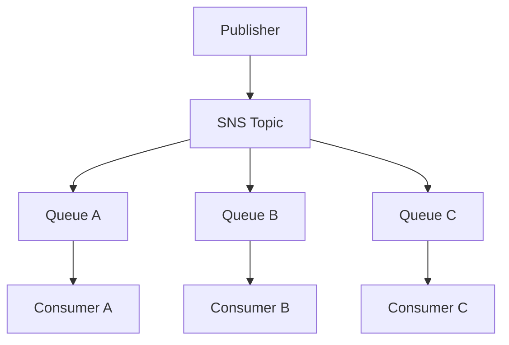
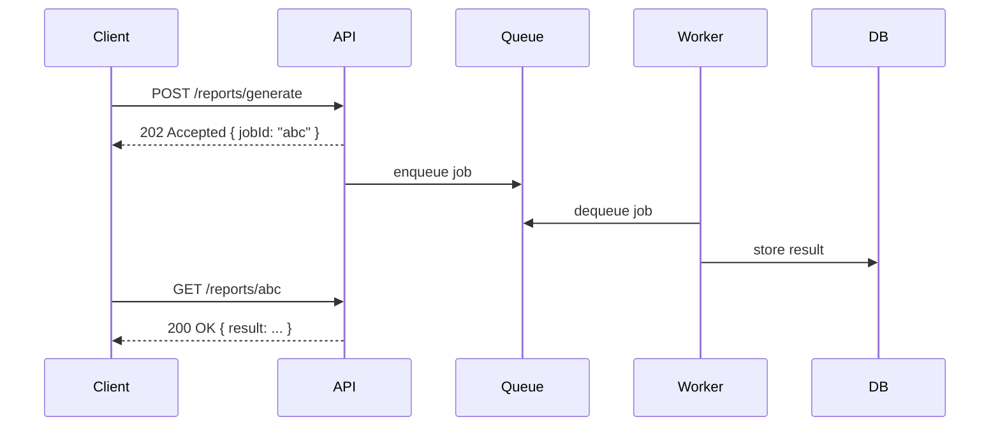

# Messaging Patterns

[Enterprise Integration Patterns](https://www.enterpriseintegrationpatterns.com/) | [Martin Fowler — Event-Driven Architecture](https://martinfowler.com/articles/201701-event-driven.html)

Messaging patterns describe how services communicate asynchronously via messages rather than direct calls. They decouple producers from consumers and enable resilient, scalable distributed systems.

---

## Message Queue (Point-to-Point)

One producer sends a message; exactly one consumer processes it. The queue buffers messages so the consumer can work at its own pace.

```
Producer → [Queue] → Consumer
```

- Message is deleted from queue after successful processing
- If consumer crashes, message reappears after a visibility timeout and is retried
- Naturally load-balances across multiple consumers

**Use cases:** background job processing, task offloading, rate limiting
**AWS:** SQS Standard Queue / FIFO Queue

---

## Pub/Sub (Publish-Subscribe)

One producer publishes a message to a **topic**; all subscribed consumers receive a copy.

```
Publisher → [Topic] → Subscriber A
                    → Subscriber B
                    → Subscriber C
```

- Producer has no knowledge of consumers
- Consumers can join or leave without changing the producer
- Each subscriber gets its own independent copy

**Use cases:** event broadcasting, notifying multiple systems of a state change
**AWS:** SNS Topic

---

## Fan-Out Pattern

Combines pub/sub and message queues: a topic broadcasts to multiple queues, each serving an independent consumer.



**Why add queues between topic and consumer?**
- Queues buffer messages if a consumer is temporarily slow or down
- Enables independent scaling per consumer
- Provides retry logic and dead-letter queue per consumer
- Without queues, a slow consumer blocks processing; with queues it just falls behind

**Use cases:** one event triggering multiple independent reactions in parallel

---

## Asynchronous Request-Response

Client sends a request and gets an immediate acknowledgement (job ID), then retrieves the result later — either by polling or via a push notification.



HTTP status `202 Accepted` specifically signals: "received, processing asynchronously."

**Polling vs Push:**
| Polling | Push (Webhook / WebSocket) |
|---|---|
| Client checks repeatedly | Server notifies client when done |
| Simple to implement | More efficient, lower latency |
| Wasteful if result takes long | Requires webhook endpoint or open connection |

---

## Webhook

A webhook is a server-to-server HTTP callback — one service notifies another by sending a POST request to a registered URL when an event occurs.

```
External Service (e.g. Stripe)
        ↓
POST https://yourapp.com/webhooks/payment
{ "event": "payment.succeeded", "amount": 9.99 }
        ↓
Your server reacts (unlock premium, send receipt)
```

**Security considerations:**
- Always verify the **signature** (HMAC hash of payload with shared secret) — anyone can POST to your URL
- Respond with `200 OK` immediately; do actual work asynchronously
- Handle duplicates — the same event may be delivered more than once (idempotency)

---

## Topic Bus with Subscription

A **topic bus** is a shared messaging backbone where services publish events and subscribe to events they care about. Nobody calls anybody directly.

Common in [[Saga Pattern|choreography-based sagas]]:

```
Service A publishes  "order.created"
Service B subscribes "order.created"  → acts, publishes "payment.completed"
Service C subscribes "payment.completed" → acts, publishes "premium.activated"
Service A subscribes "payment.failed"    → runs compensation (cancel order)
```

Each service is only aware of the event schema — not of each other.

**AWS EventBridge** is a fully managed event bus designed for this pattern, with schema registry and advanced filtering.

---

## Dead Letter Queue (DLQ)

When a message fails to process after the maximum number of retries, it is moved to a **Dead Letter Queue** rather than being discarded. Allows inspection and reprocessing of failed messages without losing them.

See also: [[Delivery Semantics]], [[Deduplication ID]]

---

## Summary

| Pattern | Direction | Consumers | Use case |
|---|---|---|---|
| **Message Queue** | Point-to-point | One | Task offloading, background jobs |
| **Pub/Sub** | Broadcast | Many | Event notifications |
| **Fan-out** | Broadcast + buffer | Many (isolated) | Parallel independent reactions |
| **Async req/resp** | Request-reply | One | Long-running operations |
| **Webhook** | Server push | One endpoint | Cross-system event notification |
| **Topic Bus** | Broadcast | Many (filtered) | Choreography-based sagas |

---

## Related Topics

- [[Saga Pattern]] — choreography sagas are implemented with topic buses and pub/sub
- [[Circuit Breaker]] — protects synchronous calls; messaging patterns are the async alternative
- [[Observability]] — queue depth, consumer lag, and DLQ message count are key metrics
- [[Cloud Native]] — event-driven messaging is a core cloud-native architecture pattern
- [[Event-Driven Architecture]] — EDA is the architectural style that these messaging patterns implement
- [[Delivery Semantics]] — at-most-once, at-least-once, exactly-once delivery guarantees
- [[Backpressure]] — flow control mechanism for slowing producers when consumers fall behind
- [[Load Shedding]] — dropping excess work when a system is overwhelmed
